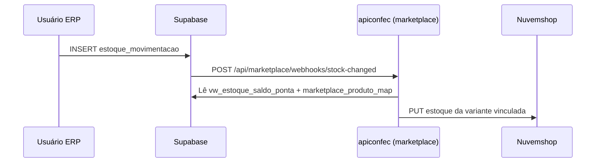

# apiconfec.azoup.com.br — como funciona e integração com e-commerce

Documento para entender a **API do Confec (ERP)** e o que falta para o **estoque do e-commerce (Nuvemshop)** atualizar automaticamente quando o estoque muda no sistema.

---

## 1. Visão geral dos sistemas

| Peça | URL / projeto | Função |
|------|----------------|--------|
| **Frontend ERP (Confec)** | `https://confec.azoup.com.br` | App web/mobile (Expo) — telas de venda, estoque, produção, etc. |
| **API Node (Confec)** | `https://apiconfec.azoup.com.br` | Backend Express em `RNWebSupabase/backend/` |
| **Banco** | Supabase (Postgres) | Mesmo projeto para ERP e integração; dados em `estoque_movimentacao`, `produtos`, etc. |
| **App e-commerce** | projeto `azoup-ecommerce` (local ou futuro deploy) | Painel Nuvemshop, OAuth, sync de catálogo/estoque — **código separado** hoje |

```
┌─────────────────────┐         JWT (anon)          ┌──────────────────────┐
│  confec.azoup.com.br │ ──────────────────────────► │  Supabase            │
│  (frontend ERP)      │   INSERT estoque_movimentacao │  Postgres + Auth     │
└──────────┬──────────┘                               └──────────┬───────────┘
           │                                                       │
           │  EXPO_PUBLIC_BACKEND_URL                              │ trigger / webhook
           ▼                                                       ▼
┌─────────────────────┐                               ┌──────────────────────┐
│ apiconfec.azoup.com.br│ ◄── deveria receber ────────│  aviso de estoque    │
│  backend/index.js    │     POST stock-changed       │  (hoje não configurado)│
└─────────────────────┘                               └──────────────────────┘
           │
           │  (futuro) push estoque
           ▼
┌─────────────────────┐
│  Nuvemshop API      │
└─────────────────────┘
```

**Ponto central:** o ERP **não grava saldo** em coluna fixa. Toda mudança de estoque deve gerar linha em `estoque_movimentacao`. O saldo é calculado (view `vw_estoque_saldo_ponta`).

---

## 2. O que é `apiconfec.azoup.com.br`

- É a URL pública do processo Node definido em **`RNWebSupabase/backend/index.js`**.
- No VPS (Hetzner), o **Caddy** faz `reverse_proxy` de `apiconfec.azoup.com.br` → `127.0.0.1:3000` (ver `deploy/Caddyfile.example`).
- O frontend aponta para ela via **`EXPO_PUBLIC_BACKEND_URL=https://apiconfec.azoup.com.br`** (`frontend/.env.example`).
- Porta padrão local: **3000** (`PORT=3000` em `backend/.env`).

### O que a API faz (hoje)

Operações que **precisam de segredo no servidor** ou lógica pesada — o resto do ERP fala **direto com o Supabase** no browser.

| Prefixo / rota | Responsabilidade |
|----------------|------------------|
| `GET /api/health` | Health check |
| `/api/billing/*` | Stripe (checkout, webhook, planos, boleto) |
| `/api/meta/*` | Meta Ads / CAPI |
| `/api/storage/*` | Upload/delete no **Cloudflare R2** |
| `/api/nfe/*` | NF-e (emitir, DANFE, cancelar, manifesto, certificado) |
| `/api/venda/pdf-from-html` | PDF de orçamento/pedido (Puppeteer) |
| `/api/media/*` | Proxy de imagens / data URL |
| `/api/ai/*` | Assistente IA, mockup, interpretação de cadastro |
| `/api/whatsapp/*` | WhatsApp Cloud API (admin + webhook Meta) |
| Rotas de auth auxiliar | Reset senha, login faccionista, login contador |

### O que a API **não** faz (hoje)

- **Não existe** `/api/marketplace/*` no repositório Confec.
- **Não existe** webhook `POST /api/marketplace/webhooks/stock-changed`.
- **Não há** código Nuvemshop OAuth/sync no `RNWebSupabase/backend/`.

Esse código está no projeto separado **`azoup-ecommerce/backend/`** (porta 3001, `BACKEND_URL=http://localhost:3001`).

Por isso, se o trigger SQL no Supabase apontar para `apiconfec` **sem você implementar a rota**, nada sincroniza. Se apontar para `localhost:3001`, o Supabase na nuvem **não alcança** sua máquina.

---

## 3. Por que o estoque do e-commerce não atualiza sozinho

Para o Azoup → Nuvemshop funcionar em automático, precisam existir **três elos**:

1. **Movimentação no ERP** — INSERT em `estoque_movimentacao` (já acontece nas telas de estoque, venda, OP, XML, inventário).
2. **Aviso ao backend** — trigger SQL (`pg_net`) ou **Database Webhook** do Supabase chamando uma URL HTTPS quando há INSERT.
3. **Backend processa** — lê saldo na ponta certa, consulta `marketplace_produto_map`, envia estoque para a Nuvemshop.

Hoje, na prática:

| Elo | Status típico |
|-----|----------------|
| 1. Ledger no Supabase | OK se você usa as telas do Confec |
| 2. Webhook/trigger → API pública | **Falta** ou aponta para URL errada / localhost |
| 3. Rota marketplace no servidor | **Só no `azoup-ecommerce`**, não no `apiconfec` |

Além disso:

- Movimentações com observação contendo **"Nuvemshop"** ou **"e-commerce sync"** são **ignoradas** de propósito (evita loop quando o e-commerce puxa estoque da loja).
- Só dispara sync se a variação estiver em **`marketplace_produto_map`** e a loja tiver **`sync_estoque = true`**.
- A **`ponta_estoque_id`** da movimentação deve bater com a ponta configurada na integração (`marketplace_integracao.ponta_estoque_id`).

---

## 4. Como o estoque funciona no ERP (regra para integração)

Referência: `frontend/src/utils/estoque.js`, `docs/PONTA_ESTOQUE.md`.

### INSERT em `estoque_movimentacao` (produto)

| Campo | Valor |
|-------|--------|
| `cliente_id_tenant` | UUID do tenant (`clientes_azoup`) |
| `empresa_id` | UUID da empresa |
| `usuario_id` | UUID do usuário |
| `tipo_item` | `'produto'` |
| `produto_id` | UUID do produto |
| `item_id` | **Mesmo** UUID do produto (padrão do app) |
| `variacao_id` | UUID de `produto_cor_tamanho.id` |
| `status_movimentacao` | `'entrada'` ou `'saida'` |
| `quantidade` | Valor **positivo** (módulo do delta) |
| `ponta_estoque_id` | Ponta física (obrigatória após migration ponta) |
| `data_movimentacao` | Data da movimentação |
| `movimentacao_lote_id` | UUID do lote (obrigatório) |
| `observacao` | Texto livre — **sem** "Nuvemshop" / "e-commerce sync" em ajustes manuais |

**Não** atualize `produto_cor_tamanho.estoque` diretamente.

### Saldo lido pela integração

```sql
-- View usada pelo e-commerce (azoup-ecommerce/backend/lib/estoqueLedger.js)
SELECT * FROM vw_estoque_saldo_ponta
WHERE cliente_id_tenant = :tenant
  AND tipo_item = 'produto'
  AND variacao_id = :variacao_id
  AND ponta_estoque_id = :ponta_id;
```

---

## 5. Duas formas de fazer funcionar

### Opção A — Colocar marketplace no **apiconfec** (recomendado se quer um só servidor)

**Vantagem:** uma URL pública (`https://apiconfec.azoup.com.br`), mesmo VPS, mesmo deploy.

**Pacote pronto no projeto e-commerce:** `deploy/apiconfec/README.md` + script `deploy/apiconfec/copy-to-apiconfec.ps1` (só webhooks de estoque — **não** altera rotas NF-e/billing existentes).

**Passos resumidos:**

1. Copiar módulo para `RNWebSupabase/backend/marketplace-ecommerce/` (script PowerShell no README).
2. Colar o trecho de `deploy/apiconfec/index.mount.snippet.js` no `backend/index.js` do apiconfec (monta rotas **só se** `MARKETPLACE_WEBHOOK_SECRET` estiver definido).
3. Adicionar variáveis em `deploy/apiconfec/env.additions.example` no `backend/.env` do servidor.
4. Rodar SQL no Supabase (projeto `azoup-ecommerce/database/`):
   - `marketplace_schema.sql`
   - `marketplace_stock_sync_config_migration.sql`
   - `marketplace_webhook_settings_migration.sql`
   - `marketplace_stock_sync_webhook.sql`
5. Configurar a tabela ( **não** use `ALTER DATABASE` no Supabase):
   ```sql
   INSERT INTO public.marketplace_webhook_settings (id, backend_url, webhook_secret)
   VALUES (1, 'https://apiconfec.azoup.com.br', 'mesmo-MARKETPLACE_WEBHOOK_SECRET')
   ON CONFLICT (id) DO UPDATE SET
     backend_url = EXCLUDED.backend_url,
     webhook_secret = EXCLUDED.webhook_secret,
     updated_at = now();
   ```
6. Deploy do backend (`deploy-backend.yml` / PM2 no VPS).
7. Testar: `GET https://apiconfec.azoup.com.br/api/health` e depois movimentação de estoque no ERP.

**Webhook completo que o trigger chama:**

```
POST https://apiconfec.azoup.com.br/api/marketplace/webhooks/stock-changed
Header: x-marketplace-webhook-secret: <MARKETPLACE_WEBHOOK_SECRET>
Body: { "clienteId", "produtoId", "variacaoId", "pontaEstoqueId", "observacao" }
```

### Opção B — API e-commerce separada (subdomínio próprio)

Ex.: `https://api-ecommerce.azoup.com.br` → deploy só do `azoup-ecommerce/backend`.

- `marketplace_webhook_settings.backend_url` = essa URL.
- Confec continua em `apiconfec` só para NF-e, billing, etc.
- Dois processos PM2, dois deploys.

Funciona igual desde que a URL seja **HTTPS pública** e o segredo bata.

---

## 6. Fluxo automático (depois de configurado)



**Quando NÃO dispara push:**

- Observação indica origem e-commerce (`Nuvemshop`, `e-commerce sync`, …).
- Produto/variação sem vínculo em `marketplace_produto_map`.
- Loja com `sync_estoque = false`.
- Movimentação em ponta diferente da ponta da loja.

---

## 7. Onde estão os arquivos SQL (projeto e-commerce)

Pasta no PC:

```
c:\NewDevelopment\azoup-ecommerce\database\
```

| Arquivo | Quando rodar |
|---------|----------------|
| `marketplace_schema.sql` | Primeira vez — tabelas de integração |
| `marketplace_stock_sync_config_migration.sql` | Coluna `sync_estoque` |
| `marketplace_webhook_settings_migration.sql` | Tabela de URL/segredo (substitui ALTER DATABASE) |
| `marketplace_stock_sync_webhook.sql` | Trigger após INSERT em estoque |

Rodar no **SQL Editor** do Supabase do tenant (mesmo banco do Confec).

---

## 8. Deploy e operação do apiconfec

| Item | Onde |
|------|------|
| Código | `RNWebSupabase/backend/` |
| CI deploy | `.github/workflows/deploy-backend.yml` |
| Caddy | `deploy/Caddyfile.example` → `apiconfec.azoup.com.br` → `:3000` |
| Processo | PM2 (`PM2_APP_NAME` no GitHub Secrets) |
| Segredos servidor | `backend/.env` (nunca commitar) |
| Frontend apontando API | GitHub Secret `EXPO_PUBLIC_BACKEND_URL` |

Documentação geral de deploy: `DEPLOY.md` na raiz do repositório Confec.

---

## 9. Checklist — estoque e-commerce automático

### Banco (Supabase)

- [ ] Tabelas `marketplace_integracao`, `marketplace_produto_map` existem
- [ ] Loja Nuvemshop conectada (`status = connected`)
- [ ] `ponta_estoque_id` na integração = ponta usada nas movimentações do ERP
- [ ] Produtos exportados/importados com mapa variação ↔ SKU Nuvemshop
- [ ] `marketplace_webhook_settings` com `backend_url` HTTPS e `webhook_secret`
- [ ] Trigger `trg_marketplace_stock_change` ativo **ou** Database Webhook no painel
- [ ] Extensão **pg_net** habilitada (se usar trigger)

### Backend (apiconfec ou API e-commerce)

- [ ] Rota `POST /api/marketplace/webhooks/stock-changed` implementada e deployada
- [ ] `MARKETPLACE_WEBHOOK_SECRET` igual ao configurado no Supabase
- [ ] Credenciais Nuvemshop (`NUVEMSHOP_CLIENT_ID`, `NUVEMSHOP_CLIENT_SECRET`)
- [ ] `TOKEN_ENCRYPTION_KEY` para tokens das lojas

### Teste manual

1. Anote saldo atual na Nuvemshop de uma variação mapeada.
2. No Confec, faça **entrada** ou **saída** nessa variação na **mesma ponta** da loja (observação sem "Nuvemshop").
3. Verifique logs do PM2 no VPS.
4. Confira estoque na loja (pode levar alguns segundos).

Teste da API:

```bash
curl -s https://apiconfec.azoup.com.br/api/health
```

---

## 10. Erros comuns

| Sintoma | Causa provável |
|---------|----------------|
| `permission denied to set parameter app.marketplace_webhook_*` | Tentou `ALTER DATABASE` no Supabase — use `marketplace_webhook_settings` |
| Nada acontece após movimentação | `backend_url` vazio na tabela ou trigger não instalado |
| Webhook 401 | `MARKETPLACE_WEBHOOK_SECRET` diferente entre Supabase e `.env` |
| Webhook 404 | Marketplace ainda não foi adicionado ao `apiconfec` |
| Loop ou estoque “volta” | Movimentação e sync na mesma ponta com observação errada |
| Saldo errado na loja | Ponta da movimentação ≠ ponta da integração |

---

## 11. Referências no repositório

| Tema | Caminho |
|------|---------|
| Backend Confec | `backend/index.js` |
| URL no frontend | `frontend/src/utils/backendUrl.js` |
| Estoque (ledger) | `frontend/src/utils/estoque.js` |
| Telas movimentação | `frontend/src/components/EstoqueMovimentacaoScreen.js` |
| Ponta de estoque | `docs/PONTA_ESTOQUE.md` |
| Arquitetura geral | `docs/DOCUMENTACAO_SISTEMA.md` |
| Código marketplace (origem) | `../azoup-ecommerce/backend/lib/marketplaceStockSync.js` |
| SQL webhook estoque | `../azoup-ecommerce/database/marketplace_stock_sync_webhook.sql` |
| Doc estoque e-commerce | `../azoup-ecommerce/SISTEMA_ESTOQUE_INTEGRACAO_ECOMMERCE.md` |

---

## 12. Resumo em uma frase

**`apiconfec.azoup.com.br` é a API Node do ERP (NF-e, billing, R2, IA); ela ainda não inclui marketplace — para o estoque ir sozinho para a Nuvemshop você precisa expor `POST /api/marketplace/webhooks/stock-changed` nessa API (ou em outra URL pública), configurar o Supabase para chamar essa URL após INSERT em `estoque_movimentacao`, e manter produtos mapeados com a ponta de estoque correta.**
