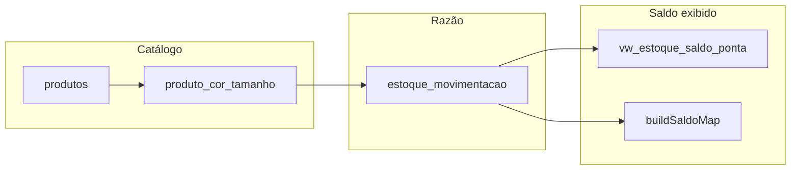
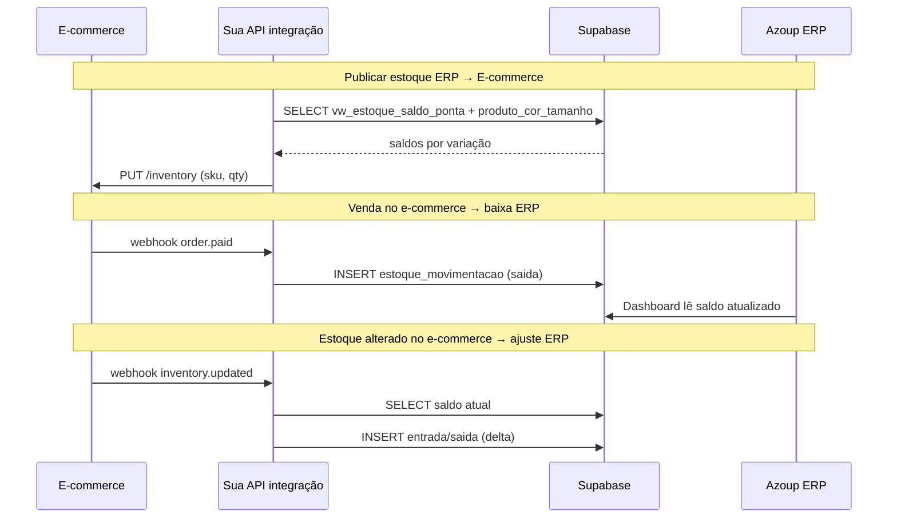

# Sistema de Estoque — Telas, Tabelas e Integração E-commerce

Documento de referência para **integrar um e-commerce** com o Azoup: ler saldos, enviar estoque do e-commerce para o ERP, ou publicar o estoque do ERP no e-commerce.

**Fontes no código:** `frontend/src/utils/estoque.js`, `pontaEstoqueService.js`, telas em `frontend/src/components/Estoque*.js`, migrations em `frontend/database/`.

---

## 1. Conceito central — estoque é um razão (ledger)

No Azoup **não existe tabela `estoque_saldo`**. O saldo é **calculado** somando movimentações:

```
saldo = Σ entradas − Σ saídas
```

Por **item + variação + ponta (local físico)**.



### Regra crítica para integração

| Faça | Não faça |
|------|----------|
| Inserir linhas em **`estoque_movimentacao`** | Atualizar `produto_cor_tamanho.estoque` diretamente |
| Usar `variacao_id` = `produto_cor_tamanho.id` | Assumir saldo na coluna legada `estoque` |
| Informar `ponta_estoque_id` | Ignorar ponta (saldo fica inconsistente) |

A coluna `produto_cor_tamanho.estoque` existe no schema legado, mas **não é mais a fonte da verdade** — o app não grava nela nos formulários atuais.

---

## 2. Chave de saldo (como identificar um SKU no estoque)

Saldo único = combinação de:

| Dimensão | Campo | Exemplo |
|----------|-------|---------|
| Tipo | `tipo_item` | `'produto'` (e-commerce usa produto) |
| Item | `item_id` / `produto_id` | UUID do produto |
| Variação | `variacao_id` | UUID de `produto_cor_tamanho` (cor/tamanho) |
| Local | `ponta_estoque_id` | UUID de `pontas_estoque` |

**Chave interna (string):**

```
produto:{produto_id}:{variacao_id}:{ponta_estoque_id}
```

Se não houver variação: `variacao_id` = `null` → chave usa `base`.

**Implementação:** `buildSaldoKey()` em `frontend/src/utils/estoque.js`.

### Mapeamento e-commerce ↔ Azoup

| E-commerce | Azoup |
|------------|-------|
| SKU pai | `produtos.sku` |
| SKU variação | `produto_cor_tamanho.sku_variacao` |
| EAN/GTIN | `produto_cor_tamanho.ean13` |
| ID interno preferido | `produto_cor_tamanho.id` → usar como `variacao_id` nas movimentações |
| Cor / tamanho | `produto_cor_tamanho.cor`, `.tamanho` |

Para integração robusta, mantenha uma tabela de de-para no e-commerce:

```
ecommerce_variant_id → produto_cor_tamanho.id (UUID Azoup)
```

---

## 3. Tipos de movimentação

Apenas dois valores permitidos no banco (`CHECK`):

| `status_movimentacao` | Efeito no saldo |
|----------------------|-----------------|
| `entrada` | + quantidade |
| `saida` | − quantidade |

Origens no sistema:

| Origem | Tipo típico | Observação |
|--------|-------------|------------|
| Entrada/saída manual | entrada ou saida | `EstoqueMovimentacaoScreen` |
| Importação XML NF-e | entrada | `ImportacaoXmlEstoqueScreen` |
| Inventário (ajuste) | entrada ou saida | diferença contada − sistema |
| Venda / expedição | saida | `registrarMovimentacaoEstoqueVenda` |
| Estorno venda/cancelamento | entrada | `VendaKanban`, backend |
| Produção (acabado) | entrada | `ProducaoKanban` |
| Produção (matéria-prima) | saida | `estoqueBaixaProducao.js` |
| Transferência entre pontas | saida + entrada (par) | `registrarTransferenciaPonta` |
| **Integração e-commerce** | entrada ou saida | Recomendado: movimentação de ajuste |

---

## 4. Tabela principal — `estoque_movimentacao`

**Migration:** `frontend/database/migration_estoque_movimentacao.sql`  
**Extensões:** `migration_estoque_movimentacao_fornecedor_lote.sql`, `migration_ponta_estoque.sql`, `migration_estoque_mov_nota_entrada_id.sql`

| Campo | Tipo | Obrigatório integração | Descrição |
|-------|------|------------------------|-----------|
| `id` | UUID PK | auto | |
| `cliente_id_tenant` | UUID → `clientes_azoup` | **sim** | Tenant |
| `empresa_id` | UUID → `empresas` | **sim** | CNPJ vinculado |
| `usuario_id` | UUID → `usuarios` | **sim** | Usuário técnico da integração |
| `item_id` | UUID | **sim** | = `produto_id` para produtos |
| `produto_id` | UUID | **sim** (produto) | FK produto |
| `tecido_id`, `aviamento_id` | UUID | null p/ produto | |
| `variacao_id` | UUID | **recomendado** | `produto_cor_tamanho.id` |
| `tipo_item` | TEXT | **sim** | `'produto'` |
| `status_movimentacao` | TEXT | **sim** | `'entrada'` ou `'saida'` |
| `quantidade` | NUMERIC(14,3) | **sim** | Sempre > 0 |
| `data_movimentacao` | DATE | **sim** | Data contábil |
| `ponta_estoque_id` | UUID → `pontas_estoque` | **sim** | Local do estoque |
| `ponta_estoque_destino_id` | UUID | transferências | Destino (saída na transferência) |
| `movimentacao_lote_id` | UUID | **sim** | Agrupa linhas do mesmo evento |
| `observacao` | TEXT | recomendado | Rastreio: `"E-commerce sync #123"` |
| `fornecedor_id` | UUID | opcional | Entrada manual |
| `nota_fiscal_entrada_id` | UUID | opcional | Vínculo NF entrada |
| `created_at`, `updated_at` | TIMESTAMPTZ | auto | |

**Constraints:**

- Exatamente um de `produto_id` / `tecido_id` / `aviamento_id` preenchido
- `tipo_item` deve bater com o FK preenchido
- `quantidade > 0` (direção vem de entrada/saída)

---

## 5. Ponta de estoque (multi-depósito)

**Doc:** `docs/PONTA_ESTOQUE.md`  
**Migration:** `frontend/database/migration_ponta_estoque.sql`

### `pontas_estoque`

| Campo | Descrição |
|-------|-----------|
| `id` | UUID |
| `cliente_id_tenant` | Tenant |
| `codigo` | Código único por tenant (ex.: `PRINCIPAL`, `ECOMMERCE`) |
| `nome` | Nome exibido |
| `padrao` | Uma ponta padrão por tenant |
| `permite_venda`, `permite_producao` | Flags |
| `ativo` | |

### Vínculos

| Entidade | Campo | Uso |
|----------|-------|-----|
| `empresas` | `ponta_estoque_id` | Ponta padrão da empresa |
| `estoque_movimentacao` | `ponta_estoque_id` | Onde a movimentação incide |
| `estoque_inventario` | `ponta_estoque_id` | Inventário por local |

**Para e-commerce:** crie uma ponta dedicada (ex.: `ECOMMERCE`) ou use a ponta padrão da empresa (`empresas.ponta_estoque_id`). Leia saldo **filtrando por ponta** se o depósito virtual do e-commerce for separado.

**RPC:** `ensure_ponta_estoque_padrao(cliente_id)` — garante "Estoque Principal".

---

## 6. View de saldo — `vw_estoque_saldo_ponta`

Agregação SQL (equivalente ao `buildSaldoMap`):

```sql
SELECT
  cliente_id_tenant,
  tipo_item,
  item_id,
  variacao_id,
  ponta_estoque_id,
  SUM(CASE WHEN status_movimentacao = 'entrada' THEN quantidade ELSE -quantidade END) AS quantidade
FROM estoque_movimentacao
GROUP BY 1, 2, 3, 4, 5;
```

**Consulta recomendada para integração (produtos de um tenant):**

```sql
SELECT *
FROM vw_estoque_saldo_ponta
WHERE cliente_id_tenant = :tenant_id
  AND tipo_item = 'produto'
  AND ponta_estoque_id = :ponta_id
  AND quantidade <> 0;
```

No frontend: `fetchEstoqueSaldoPonta()` em `estoque.js`.

---

## 7. Tabelas auxiliares de estoque

### Inventário físico

| Tabela | Função |
|--------|--------|
| `estoque_inventario` | Cabeçalho (empresa, ponta, data, usuário) |
| `estoque_inventario_item` | Linhas: `quantidade_sistema`, `quantidade_contada`, `diferenca` |

Ao salvar inventário, gera movimentações de ajuste para cada `diferenca ≠ 0`.

### Configuração de alertas

| Tabela | Função |
|--------|--------|
| `configuracoes_estoque` | Limites de estoque baixo por tipo (produto/tecido/aviamento) |

### Nota fiscal de entrada (estoque via compra)

| Tabela | Função |
|--------|--------|
| `nota_fiscal_entrada` | Cabeçalho NF entrada |
| `nota_fiscal_entrada_item` | Itens (+ `variacao_id`) |
| `nota_fiscal_entrada_xml` | XML armazenado |
| `estoque_movimentacao.nota_fiscal_entrada_id` | Rastreio |

### Catálogo (leitura para integração)

| Tabela | Uso e-commerce |
|--------|----------------|
| `produtos` | SKU pai, nome, NCM, inativo |
| `produto_cor_tamanho` | Variação cor/tamanho, `sku_variacao`, `ean13` |
| `produto_cor_tamanho_tabela_preco` | Preço por tabela |
| `tabela_precos` | Tabela "Padrão" do tenant |

**Query catálogo (mesma do app):** `fetchEstoqueCatalog(clienteId)` — retorna produtos + variações + tecidos + aviamentos.

---

## 8. Telas do módulo Estoque

Menu lateral: seção **Estoque** em `DashboardScreen.js`.

| Menu | Componente | Função | Grava em |
|------|------------|--------|----------|
| Dashboard Estoque | `EstoqueDashboardScreen.js` | KPIs, alertas, últimas movimentações | — (leitura) |
| Notas de Entrada | `NotaFiscalEntradaList.js` | Lista NF entrada; excluir reverte estoque | DELETE movimentações |
| Importar XML | `ImportacaoXmlEstoqueScreen.js` | NF-e XML ou manual → entrada estoque | NF + `estoque_movimentacao` |
| Entradas/Saídas Manuais | `EstoqueMovimentacaoScreen.js` | Lotes manuais entrada/saída | `estoque_movimentacao` |
| Extrato de Movimentações | `EstoqueRelatorioMovimentacaoScreen.js` | Extrato com saldo corrente | — |
| Relatório Estoque | `EstoqueRelatorioPontaScreen.js` | Posição por ponta, custos, PDF/CSV | — |
| Transferência | `EstoqueTransferenciaPontaScreen.js` | Move entre pontas | 2 movimentações/lote |
| Inventário | `InventarioListScreen.js` + `InventarioFormScreen.js` | Contagem física + ajuste | inventário + movimentações |
| Pontas de Estoque | `PontaEstoqueList.js` / `PontaEstoqueForm.js` | CRUD locais | `pontas_estoque` |
| Config. Estoque | `EstoqueConfiguracoesScreen.js` | Limites alerta | `configuracoes_estoque` |

### Estoque por variação na UI

**`ProdutoDashboardScreen.js`** — seção "Estoque por Variação":

- Tabela Cor | Tamanho | Estoque | Preço
- Filtro por ponta (`PontaEstoqueFilterSelect`)
- Saldo via `fetchMovimentacoesPorItem` + `buildSaldoMap`

---

## 9. Integração E-commerce — padrões recomendados

### 9.1 Ler estoque do Azoup → publicar no e-commerce

**Fluxo:**

```
1. Autenticar (service role ou usuário técnico)
2. SELECT vw_estoque_saldo_ponta WHERE tenant + ponta + tipo_item = 'produto'
3. JOIN produto_cor_tamanho ON variacao_id = produto_cor_tamanho.id
4. JOIN produtos ON produto_id
5. Para cada variação: PATCH estoque no e-commerce (sku_variacao / ean13)
```

**Campos úteis para o e-commerce:**

| Azoup | Enviar ao e-commerce |
|-------|---------------------|
| `quantidade` (saldo) | `inventory_quantity` / `stock` |
| `sku_variacao` ou `produtos.sku` | SKU da variação |
| `ean13` | barcode |
| `produtos.inativo` | despublicar se inativo |

**Frequência:** job agendado (ex.: a cada 15 min) ou webhook após movimentação.

---

### 9.2 Receber estoque do e-commerce → gravar no Azoup

**Nunca** faça `UPDATE produto_cor_tamanho SET estoque = X`.

**Opção A — Ajuste por diferença (recomendado):**

```
saldo_azoup = consultar vw_estoque_saldo_ponta
saldo_ecommerce = valor recebido
delta = saldo_ecommerce - saldo_azoup

if delta > 0  → INSERT estoque_movimentacao status_movimentacao = 'entrada', quantidade = delta
if delta < 0  → INSERT estoque_movimentacao status_movimentacao = 'saida',  quantidade = abs(delta)
if delta == 0 → nada
```

**Opção B — Inventário programático:**

Simular o que `InventarioFormScreen` faz: gravar `estoque_inventario` + itens + movimentações de ajuste. Mais pesado; use só se precisar de auditoria formal de inventário.

**Opção C — Venda do e-commerce → baixa no Azoup:**

Quando o e-commerce vender, inserir **`saida`** (mesmo padrão de `registrarMovimentacaoEstoqueVenda`):

```javascript
{
  tipo_item: 'produto',
  item_id: produto_id,
  produto_id: produto_id,
  variacao_id: produto_cor_tamanho_id,
  status_movimentacao: 'saida',
  quantidade: qtd_vendida,
  observacao: 'E-commerce pedido #12345',
  movimentacao_lote_id: uuid_do_lote,
  // + tenant, empresa, usuario, ponta
}
```

Cancelamento do pedido → **`entrada`** com mesma quantidade (estorno).

---

### 9.3 Payload exemplo — ajuste de estoque (integração)

```json
{
  "cliente_id_tenant": "uuid-tenant",
  "empresa_id": "uuid-empresa",
  "usuario_id": "uuid-usuario-integracao",
  "item_id": "uuid-produto",
  "produto_id": "uuid-produto",
  "variacao_id": "uuid-produto-cor-tamanho",
  "tipo_item": "produto",
  "status_movimentacao": "entrada",
  "quantidade": 5,
  "data_movimentacao": "2026-06-23",
  "ponta_estoque_id": "uuid-ponta",
  "movimentacao_lote_id": "uuid-lote-unico-por-sync",
  "observacao": "E-commerce sync 2026-06-23T10:00:00Z"
}
```

**SQL ilustrativo (ajuste +5 unidades):**

```sql
INSERT INTO estoque_movimentacao (
  cliente_id_tenant, empresa_id, usuario_id,
  item_id, produto_id, variacao_id, tipo_item,
  status_movimentacao, quantidade, data_movimentacao,
  ponta_estoque_id, movimentacao_lote_id, observacao
) VALUES (
  '...tenant...', '...empresa...', '...usuario...',
  '...produto...', '...produto...', '...variacao...', 'produto',
  'entrada', 5, CURRENT_DATE,
  '...ponta...', gen_random_uuid(), 'E-commerce sync batch 2026-06-23'
);
```

Use o **mesmo `movimentacao_lote_id`** para todas as linhas de um lote de sincronização.

---

### 9.4 Idempotência e rastreio

Não há campo `id_externo` em `estoque_movimentacao`. Boas práticas:

1. **`observacao`** padronizada: `E-commerce sync {batch_id}` ou `E-commerce order {order_id}`
2. **`movimentacao_lote_id`** compartilhado por batch
3. Antes de reprocessar, consultar movimentações recentes:

```sql
SELECT id FROM estoque_movimentacao
WHERE cliente_id_tenant = :tenant
  AND observacao LIKE 'E-commerce order #12345%'
LIMIT 1;
```

4. Para sync completo, armazene `last_sync_at` e hash do payload no sistema e-commerce

---

### 9.5 Autenticação da integração

| Abordagem | Quando usar |
|-----------|-------------|
| **Service role** (backend Node) | Jobs batch, sync massivo — ignora RLS |
| **Usuário técnico** (`usuarios` + Auth) | API intermediária com JWT — respeita RLS |

**RLS em `estoque_movimentacao`:** INSERT exige que `usuario_id` pertença ao mesmo `cliente_id_tenant` da sessão e que `empresa_id` seja da mesma tenant.

Recomendação: criar usuário **`integracao@empresa.com`** (`eh_admin` ou permissões de estoque) e rodar sync via backend com service role ou JWT desse usuário.

**Não há endpoint REST dedicado a estoque** no backend Azoup — integração via **Supabase direto** ou **API própria** que encapsula inserts.

---

## 10. Sincronização bidirecional — diagrama



---

## 11. Outros fluxos que alteram estoque (evitar conflito)

Se o e-commerce sincroniza saldo, esteja ciente de movimentações automáticas do ERP:

| Evento no Azoup | Efeito no saldo |
|-----------------|-----------------|
| Expedição / faturamento venda | Saída produto |
| Cancelamento venda (com expedição) | Entrada (estorno) |
| Importação XML compra | Entrada |
| Finalização OP produção | Entrada produto acabado |
| Baixa MP na produção | Saída tecido/aviamento |
| Inventário | Ajuste entrada/saída |
| Transferência ponta | Saída origem + entrada destino |

**Estratégias:**

- **Ponta separada para e-commerce** — sync só dessa ponta; ERP opera na ponta "Principal"
- **E-commerce como canal de venda** — baixas via webhook de pedido (não sync de quantidade absoluta)
- **Sync absoluto periódico** — sobrescreve diferença via ajuste (Opção A); aceita que ERP e e-commerce podem divergir entre syncs

---

## 12. Consultas úteis para integração

### Saldo de uma variação

```sql
SELECT COALESCE(SUM(
  CASE WHEN status_movimentacao = 'entrada' THEN quantidade ELSE -quantidade END
), 0) AS saldo
FROM estoque_movimentacao
WHERE cliente_id_tenant = :tenant
  AND tipo_item = 'produto'
  AND produto_id = :produto_id
  AND variacao_id = :variacao_id
  AND ponta_estoque_id = :ponta_id;
```

### Resolver variação por SKU

```sql
SELECT pct.id AS variacao_id, pct.produto_id, p.sku, pct.cor, pct.tamanho, pct.sku_variacao, pct.ean13
FROM produto_cor_tamanho pct
JOIN produtos p ON p.id = pct.produto_id
WHERE p.cliente_id = :tenant
  AND (pct.sku_variacao = :sku OR p.sku = :sku OR pct.ean13 = :ean)
LIMIT 1;
```

### Listar catálogo com saldo (export e-commerce)

```sql
SELECT
  p.id AS produto_id,
  p.sku AS sku_pai,
  p.nome,
  pct.id AS variacao_id,
  pct.cor,
  pct.tamanho,
  pct.sku_variacao,
  pct.ean13,
  COALESCE(v.quantidade, 0) AS saldo
FROM produtos p
JOIN produto_cor_tamanho pct ON pct.produto_id = p.id
LEFT JOIN vw_estoque_saldo_ponta v
  ON v.item_id = p.id
 AND v.variacao_id = pct.id
 AND v.tipo_item = 'produto'
 AND v.ponta_estoque_id = :ponta_id
 AND v.cliente_id_tenant = :tenant
WHERE p.cliente_id = :tenant
  AND COALESCE(p.inativo, false) = false;
```

---

## 13. Checklist integração e-commerce

### Setup inicial

- [ ] Tenant (`clientes_azoup.id`) e empresa (`empresas.id`) identificados
- [ ] Ponta de estoque definida (`pontas_estoque.id` ou `empresas.ponta_estoque_id`)
- [ ] Usuário técnico de integração em `usuarios` + Auth
- [ ] Mapeamento `ecommerce_variant_id` ↔ `produto_cor_tamanho.id`
- [ ] Produtos e variações já cadastrados no Azoup (ver doc produtos)

### Sync ERP → e-commerce

- [ ] Job lê `vw_estoque_saldo_ponta` filtrado por ponta
- [ ] Publica quantidade por SKU/EAN no e-commerce
- [ ] Trata produto inativo (`produtos.inativo`)

### Sync e-commerce → ERP

- [ ] Calcula delta vs saldo Azoup (não grava estoque absoluto na coluna legada)
- [ ] Insere `estoque_movimentacao` entrada/saída
- [ ] Usa `movimentacao_lote_id` + `observacao` para idempotência
- [ ] Webhook de venda gera `saida`; cancelamento gera `entrada`

### Operacional

- [ ] Monitorar conflito com vendas ERP, XML, produção, inventário
- [ ] Log de batches de sync no sistema intermediário
- [ ] Alertas se variação não encontrada por SKU

---

## 14. Arquivos de referência

| Assunto | Caminho |
|---------|---------|
| Lógica de saldo | `frontend/src/utils/estoque.js` |
| Pontas / transferência | `frontend/src/utils/pontaEstoqueService.js` |
| Baixa venda | `registrarMovimentacaoEstoqueVenda` em `estoque.js` |
| Baixa produção | `frontend/src/utils/estoqueBaixaProducao.js` |
| Migration movimentação | `frontend/database/migration_estoque_movimentacao.sql` |
| Migration ponta | `frontend/database/migration_ponta_estoque.sql` |
| Migration inventário | `frontend/database/migration_estoque_inventario.sql` |
| Doc ponta | `docs/PONTA_ESTOQUE.md` |
| Doc produtos / variações | `docs/KANBAN_VENDA_PEDIDO_APROVADO_E_PRODUTOS.md` |
| Schema consolidado | `frontend/database/SUPABASE_FULL_SCHEMA.sql` |
| Tela movimentação manual | `frontend/src/components/EstoqueMovimentacaoScreen.js` |
| Importação XML | `frontend/src/components/ImportacaoXmlEstoqueScreen.js` |
| Inventário | `frontend/src/components/InventarioFormScreen.js` |
| Relatório ponta | `frontend/src/components/EstoqueRelatorioPontaScreen.js` |
| Dashboard produto | `frontend/src/components/ProdutoDashboardScreen.js` |

---

## 15. Glossário

| Termo | Significado |
|-------|-------------|
| **Ledger / razão** | `estoque_movimentacao` — histórico imutável de entradas e saídas |
| **Saldo** | Soma algébrica das movimentações; não é coluna editável |
| **Ponta** | Local físico ou lógico de estoque (`pontas_estoque`) |
| **Variação** | Cor/tamanho (`produto_cor_tamanho`) — granularidade do estoque de produto |
| **Lote** | `movimentacao_lote_id` — agrupa linhas do mesmo evento |
| **Tenant** | `clientes_azoup` — conta SaaS |
| **Ajuste** | Movimentação entrada/saída para corrigir diferença de sync |
