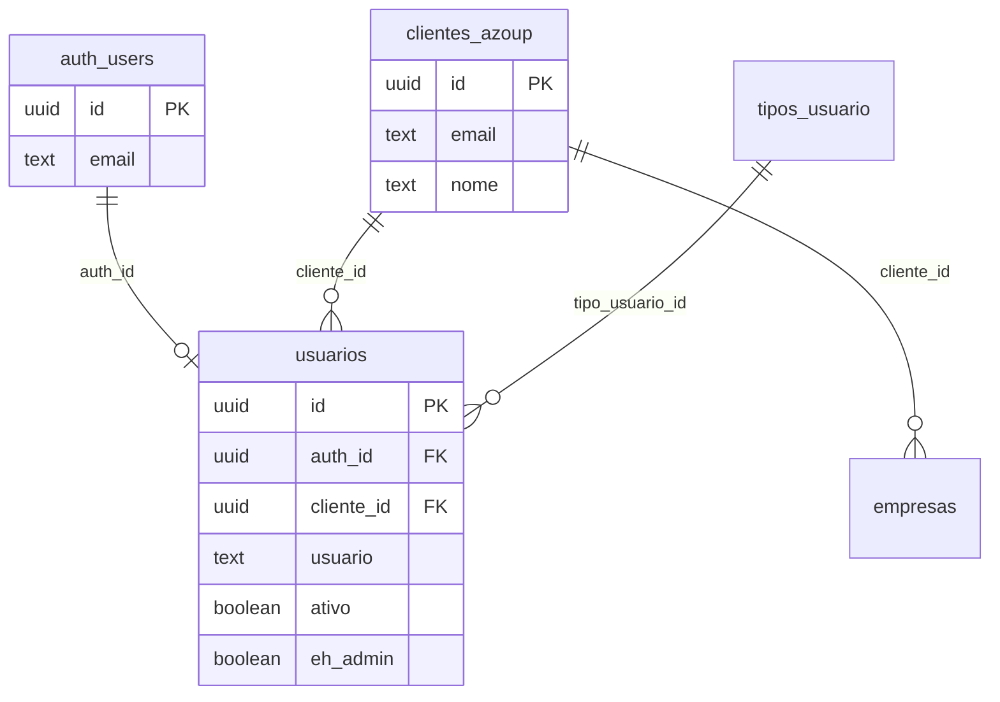
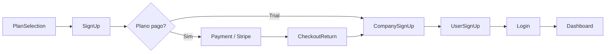
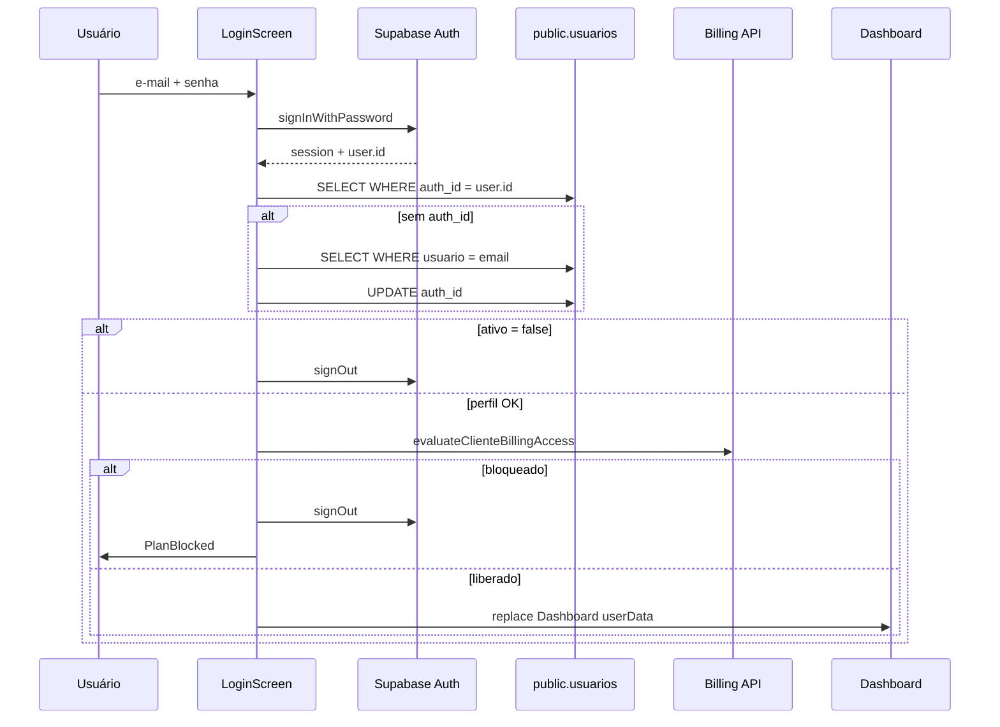

# Sistema de Login — Azoup Confecção

Documento de referência sobre **autenticação, tabelas, fluxos e permissões** do sistema web/mobile Azoup.

**Fontes no código:** `LoginScreen.js`, `UserSignUpScreen.js`, `withAuthGuard.js`, `resolveSessionUserProfile.js`, `App.js`, `backend/secure_database.sql`, `backend/passwordResetRoutes.js`.

---

## 1. Visão geral — duas camadas de identidade

O login usa **duas camadas** que trabalham juntas:

| Camada | Onde fica | Função |
|--------|-----------|--------|
| **Credenciais** | `auth.users` (Supabase Auth) | E-mail, senha criptografada, JWT (access + refresh token) |
| **Perfil do app** | `public.usuarios` | Nome, tenant, permissões, ativo/inativo, vínculo com Auth |



**Regra prática:** o usuário digita e-mail/senha → Supabase Auth valida → o app carrega `usuarios` pelo `auth_id` → só então libera o Dashboard.

A senha **não** é mais gravada em `usuarios.senha` nos cadastros novos; fica apenas no Supabase Auth.

---

## 2. Fluxo de login (passo a passo)

**Arquivo:** `frontend/src/screens/LoginScreen.js`

```
1. Usuário informa e-mail + senha
2. Validação local (campos obrigatórios; e-mail trim + lowercase)
3. supabase.auth.signInWithPassword({ email, password })
4. Busca perfil: SELECT * FROM usuarios WHERE auth_id = auth.user.id
5. Se não achar → fallback: SELECT * FROM usuarios WHERE usuario = email
   └── Se achar, UPDATE usuarios SET auth_id = auth.user.id (vínculo legado)
6. Se ainda não houver perfil → erro + signOut()
7. Se usuarios.ativo = false → alerta "Login inativado" + signOut()
8. Verificação de billing (trial/assinatura) via evaluateClienteBillingAccess()
9. setAuditUser(perfil) + navigation.replace('Dashboard', { userData })
```

### Campos da tela de login

| Campo | Componente | Validação |
|-------|------------|-----------|
| E-mail | `FormInput` | Obrigatório; normalizado `trim().toLowerCase()` |
| Senha | `FormPasswordInput` | Obrigatório |

### Links da tela

| Ação | Destino |
|------|---------|
| Cadastre-se | `PlanSelection` (fluxo de novo tenant) |
| Esqueceu a senha? | Modal em 2 etapas (código por e-mail) |

---

## 3. Sessão e persistência

### Cliente Supabase

**Arquivo:** `frontend/src/services/supabase.js`

- Variáveis: `EXPO_PUBLIC_SUPABASE_URL`, `EXPO_PUBLIC_SUPABASE_ANON_KEY`
- O SDK guarda a sessão localmente e **renova o token automaticamente** (refresh)
- Não há chamada manual a `refreshSession()` no app

### Bootstrap no `App.js`

| Evento | Comportamento |
|--------|---------------|
| `getSession()` na abertura | Define `hasSession` e `authReady` |
| `onAuthStateChange` | Mantém `hasSession` sincronizado |
| Refresh token inválido | `signOut({ scope: 'local' })` |
| Web sem sessão em `/app` ou `/cobranca` | Redireciona para `/login` |

### Guarda de rotas protegidas

**Arquivo:** `frontend/src/utils/withAuthGuard.js`

Aplicado em `DashboardScreen` e `BillingDashboardScreen`.

Ordem de verificação:

1. `route.params.userData` (vindo do login — fast path)
2. `getSession()` — sem sessão → `Login`
3. `resolveSessionUserProfile(session)` — sem perfil → `Login`
4. `ativo === false` → `Login`
5. `evaluateClienteBillingAccess(cliente_id)` — bloqueado → `PlanBlocked`
6. Injeta `userData` enriquecido (inclui `desconto_maximo_percentual`) na tela

**Arquivo auxiliar:** `frontend/src/utils/resolveSessionUserProfile.js` — mesma lógica de vínculo `auth_id` / fallback por e-mail usada no login.

---

## 4. Tabelas principais

### 4.1 `auth.users` (Supabase — gerenciada pelo Auth)

| Campo | Descrição |
|-------|-----------|
| `id` | UUID — referenciado por `usuarios.auth_id` |
| `email` | E-mail de login |
| `encrypted_password` | Hash da senha (não acessível pelo app) |

Criação via `supabase.auth.signUp()` ou painel Supabase.

---

### 4.2 `public.usuarios` (perfil da aplicação)

**DDL base:** `backend/table_initialization.sql`  
**Vínculo Auth:** `backend/secure_database.sql` (`auth_id`)  
**Permissões:** `frontend/database/migration_tipos_usuario_permissoes.sql`, `migration_usuarios_eh_admin.sql`

| Campo | Tipo | Descrição |
|-------|------|-----------|
| `id` | UUID PK | ID interno do usuário no app |
| `cliente_id` | UUID FK → `clientes_azoup` | **Tenant** (conta SaaS) |
| `auth_id` | UUID FK → `auth.users` | Vínculo com Supabase Auth |
| `nome` | TEXT | Nome exibido |
| `usuario` | TEXT UNIQUE | E-mail de login (mesmo valor do Auth) |
| `senha` | TEXT | **Legado** — não preenchido em cadastros novos |
| `ativo` | BOOLEAN | `false` bloqueia login |
| `eh_admin` | BOOLEAN | Acesso total ao menu; ignora `permissoes_telas` |
| `tipo_usuario_id` | UUID FK → `tipos_usuario` | Perfil de permissões padrão |
| `permissoes_telas` | JSONB | Lista customizada de menus (`["Products","Clients",...]`) |
| `desconto_maximo_percentual` | NUMERIC | Teto de desconto em vendas/NF |
| `liberar_ia_assistente` | BOOLEAN | Botão do assistente IA |
| `foto_perfil_url` | TEXT | URL da foto (storage) |
| `created_at` | TIMESTAMPTZ | |

**Importante para integrações:**

- Para logar no Azoup, o usuário precisa existir em **Auth** e em **`usuarios`** com `auth_id` correto.
- `cliente_id` define o isolamento de dados (RLS) de todo o tenant.

---

### 4.3 `public.clientes_azoup` (tenant / conta SaaS)

Criado no cadastro inicial (`SignUpScreen`). Um tenant pode ter vários usuários e várias empresas (CNPJs).

| Campo | Descrição |
|-------|-----------|
| `id` | UUID do tenant |
| `nome`, `email`, `cpf`, `telefone` | Dados do responsável |
| `cep`, `rua`, `numero`, `bairro`, `cidade_id`, `estado` | Endereço |
| `aceitou_termos`, `aceitou_termos_em` | Aceite legal |
| `stripe_customer_id` | Cliente Stripe (billing) |
| `qtde_user` | Contagem de usuários ativos (trigger) |
| `empresas_extra`, `usuarios_extra` | Add-ons do plano |

---

### 4.4 `public.empresas` (CNPJs do tenant)

| Campo | Descrição |
|-------|-----------|
| `id` | UUID |
| `cliente_id` | FK → `clientes_azoup` |
| `razao_social`, `cnpj` | Identificação fiscal |
| `regime_id`, endereço, certificado digital, etc. | Cadastro fiscal |

Criada em `CompanySignUpScreen` durante onboarding.

---

### 4.5 `public.tipos_usuario` (perfis de acesso)

| Campo | Descrição |
|-------|-----------|
| `id`, `cliente_id` | Por tenant |
| `descricao` | Nome do perfil (ex.: Vendedor, Financeiro) |
| `telas_acesso` | JSONB — array de chaves de menu |
| `desconto_maximo_percentual` | Teto padrão do perfil |
| `liberar_ia_assistente` | Flag padrão do perfil |
| `ativo` | |

---

### 4.6 `public.password_reset_challenges` (esqueci a senha)

| Campo | Descrição |
|-------|-----------|
| `user_id` | FK → `auth.users` |
| `code_hash` | Hash bcrypt do código de 6 dígitos |
| `expires_at` | Validade (~15 min) |
| `used_at` | Uso único |

**RLS:** habilitado **sem políticas** → só o backend (`service_role`) acessa.

---

### 4.7 Tabelas de billing (gate no login)

Consultadas após login via API `GET /api/billing/subscription/:clienteId`:

| Tabela | Uso |
|--------|-----|
| `assinaturas_clientes` | Status trial/ativo/cancelado |
| `planos_assinatura` | Limites (usuários, empresas, etc.) |

**Arquivo:** `frontend/src/utils/billingAccessGate.js`

---

## 5. Cadastro de novo usuário (onboarding)

Fluxo completo para **novo tenant**:



| Etapa | Tela | O que grava |
|-------|------|-------------|
| 1 | `SignUpScreen` | `clientes_azoup` (+ trial em `assinaturas_clientes` se grátis) |
| 2 | `PaymentScreen` | Stripe Checkout (plano pago) |
| 3 | `CompanySignUpScreen` | `empresas` |
| 4 | `UserSignUpScreen` | `auth.signUp` + `usuarios` (`eh_admin: true`) |
| 5 | `LoginScreen` | Sessão + entrada no sistema |

### `UserSignUpScreen` — sequência técnica

**Arquivo:** `frontend/src/screens/UserSignUpScreen.js`

1. Valida nome, e-mail, senha (força mínima)
2. `assertCanCreateUsuario(clientId)` — limite do plano
3. `supabase.auth.signUp({ email, password })`
4. `INSERT INTO usuarios` com `auth_id`, `cliente_id`, `eh_admin: true` (sem `senha`)
5. Redireciona para `Login`

### Admin criando usuário extra

No `DashboardScreen`, administradores criam usuários com o mesmo padrão: `signUp` + `INSERT usuarios` (com `tipo_usuario_id` / `permissoes_telas` conforme formulário).

---

## 6. Esqueci a senha

**Não usa** `supabase.auth.resetPasswordForEmail()`.

Fluxo customizado via **backend Node**:

| Etapa | Endpoint | Ação |
|-------|----------|------|
| 1 | `POST /api/auth/password-reset/request` | Gera código 6 dígitos, grava `password_reset_challenges`, envia e-mail SMTP |
| 2 | `POST /api/auth/password-reset/complete` | Valida código → `auth.admin.updateUserById` com nova senha |

**Arquivos:**

- Frontend modal: `LoginScreen.js`
- Backend: `backend/passwordResetRoutes.js`
- SQL: `frontend/database/migration_password_reset.sql`
- Spec: `frontend/docs/SISTEMA_ESQUECI_SENHA.md`

**Requisitos:** `EXPO_PUBLIC_BACKEND_URL` configurada no frontend; SMTP no backend.

---

## 7. Permissões e menus após login

O objeto `userData` passado ao Dashboard contém o perfil completo de `usuarios`.

**Resolução de menus** (`DashboardScreen.js`):

```
if eh_admin → todos os menus
else if permissoes_telas.length > 0 → menus customizados
else if tipo_usuario_id → tipos_usuario.telas_acesso
else → acesso mínimo
```

| Mecanismo | Campo | Efeito |
|-----------|-------|--------|
| Administrador | `eh_admin = true` | Acesso total; menus admin (`AuditLog`, `WhatsAppIaConfig`) |
| Perfil padrão | `tipo_usuario_id` | Herda `tipos_usuario.telas_acesso` |
| Override | `permissoes_telas` | JSONB com chaves de menu; prevalece sobre o tipo |
| Desconto | `desconto_maximo_percentual` | Limite em formulários de venda/NF |
| IA | `liberar_ia_assistente` | Exibe assistente |

Chaves de menu comuns: `Products`, `Clients`, `VendaKanban`, `Companies`, `Dashboard`, etc.

---

## 8. Row Level Security (RLS)

### Função central

```sql
-- backend/secure_database.sql
CREATE OR REPLACE FUNCTION get_my_cliente_id()
RETURNS uuid AS $$
  SELECT cliente_id FROM usuarios WHERE auth_id = auth.uid() LIMIT 1;
$$ LANGUAGE sql SECURITY DEFINER;
```

Todas as consultas autenticadas do app usam `auth.uid()` → `usuarios.auth_id` → `cliente_id` para filtrar dados do tenant.

### Políticas em `usuarios`

| Política | Regra |
|----------|-------|
| `Gerenciar usuarios do mesmo cliente` | ALL onde `cliente_id = get_my_cliente_id()` |
| `Permitir auto-cadastro` | INSERT onde `auth.uid() = auth_id` |

### Políticas em `clientes_azoup`

| Política | Regra |
|----------|-------|
| `Acesso dados do cliente` | SELECT onde `id = get_my_cliente_id()` |
| Cadastro inicial | INSERT aberto para signup anônimo |

### Políticas em `empresas`

| Política | Regra |
|----------|-------|
| `Gerenciar empresas do cliente` | ALL onde `cliente_id = get_my_cliente_id()` |

**Padrão geral:** tabelas operacionais (`produtos`, `venda`, `estoque_movimentacao`, etc.) usam `cliente_id = get_my_cliente_id()` ou equivalente.

---

## 9. Gate de billing no login

**Arquivo:** `frontend/src/utils/billingAccessGate.js`

Após Auth + perfil válido, o sistema consulta a assinatura do tenant:

| Situação | Resultado |
|----------|-----------|
| Trial dentro do prazo | Acesso liberado |
| Assinatura ativa / cortesia | Acesso liberado |
| Trial expirado | `signOut` → `PlanBlocked` |
| Assinatura cancelada/inativa | `signOut` → `PlanBlocked` |
| Erro de API / conta legado | Acesso liberado (fail-open) |

---

## 10. Backend e JWT

A maior parte do backend usa **service role** (sem JWT do usuário).

Endpoints que **validam JWT** do usuário logado:

| Rota | Uso |
|------|-----|
| `POST /api/storage/upload` | Upload de arquivos |
| `POST /api/storage/delete` | Exclusão no storage |
| `POST /api/contador-auth/*` | Portal contador |

O frontend envia `Authorization: Bearer {session.access_token}` nessas chamadas.

**Password reset** e **billing** são públicos no backend (com rate limit / validações próprias).

---

## 11. Variáveis de ambiente

| Variável | Onde | Função |
|----------|------|--------|
| `EXPO_PUBLIC_SUPABASE_URL` | Frontend | URL do projeto Supabase |
| `EXPO_PUBLIC_SUPABASE_ANON_KEY` | Frontend | Chave anon (login + queries RLS) |
| `EXPO_PUBLIC_BACKEND_URL` | Frontend | API (reset senha, billing, NF-e) |
| `SUPABASE_SERVICE_ROLE_KEY` | Backend | Admin Auth, reset senha, jobs |
| `SMTP_*` | Backend | E-mail do código de reset |

---

## 12. Diagrama completo do login



---

## 13. Erros comuns e mensagens

| Situação | Comportamento |
|----------|---------------|
| E-mail/senha incorretos | "E-mail ou senha incorretos..." |
| Auth OK, sem linha em `usuarios` | "não há um perfil liberado..." + signOut |
| `ativo = false` | Modal "Login inativado" + signOut |
| Trial/assinatura inválida | Redireciona para `PlanBlocked` |
| Sessão expirada / refresh inválido | Volta ao login (guard ou App.js) |
| E-mail já cadastrado no signup | Modal de e-mail duplicado |

---

## 14. Portais paralelos (mesmo padrão)

O mesmo modelo Auth + `usuarios` é reutilizado em:

| Portal | Arquivo backend |
|--------|-----------------|
| Faccionista | `backend/faccionistaAuthRoutes.js` |
| Contador | `backend/contadorAuthRoutes.js` |

Cada um resolve tenant/perfil com lógica similar, mas telas e menus próprios.

---

## 15. Checklist — criar usuário que consiga logar

Para um sistema externo ou script de migração:

- [ ] Criar usuário em **Supabase Auth** (`signUp` ou Admin API) com e-mail e senha
- [ ] Inserir linha em **`usuarios`** com:
  - `auth_id` = `auth.users.id`
  - `cliente_id` = UUID do tenant em `clientes_azoup`
  - `usuario` = mesmo e-mail (lowercase)
  - `nome`, `ativo = true`
- [ ] Garantir que `clientes_azoup` existe e tem assinatura/trial válida (se billing ativo)
- [ ] Definir `eh_admin` ou `tipo_usuario_id` / `permissoes_telas`
- [ ] **Não** depender de `usuarios.senha` para autenticação

### Exemplo SQL (ilustrativo — senha só via Auth Admin API)

```sql
-- Perfil (após criar auth.users via Dashboard ou Admin API)
INSERT INTO usuarios (
  cliente_id, auth_id, nome, usuario, ativo, eh_admin
) VALUES (
  '...uuid-tenant...',
  '...uuid-auth-users...',
  'João Silva',
  'joao@empresa.com.br',
  true,
  false
);
```

---

## 16. Arquivos de referência

| Assunto | Caminho |
|---------|---------|
| Tela de login | `frontend/src/screens/LoginScreen.js` |
| Cadastro 1º usuário | `frontend/src/screens/UserSignUpScreen.js` |
| Guard de sessão | `frontend/src/utils/withAuthGuard.js` |
| Resolver perfil | `frontend/src/utils/resolveSessionUserProfile.js` |
| Gate billing | `frontend/src/utils/billingAccessGate.js` |
| Rotas web protegidas | `frontend/src/utils/authNavigation.js` |
| Bootstrap app | `frontend/App.js` |
| Cliente Supabase | `frontend/src/services/supabase.js` |
| DDL base usuarios | `backend/table_initialization.sql` |
| RLS produção | `backend/secure_database.sql` |
| Reset senha SQL | `frontend/database/migration_password_reset.sql` |
| Reset senha API | `backend/passwordResetRoutes.js` |
| Tipos/permissões | `frontend/database/migration_tipos_usuario_permissoes.sql` |
| Esqueci senha (spec) | `frontend/docs/SISTEMA_ESQUECI_SENHA.md` |
| Estrutura DB geral | `docs/DATABASE_STRUCTURE.md` |
| Documentação sistema | `docs/DOCUMENTACAO_SISTEMA.md` |

---

## 17. Glossário

| Termo | Significado |
|-------|-------------|
| **Tenant** | Conta SaaS em `clientes_azoup` |
| **cliente_id** (em `usuarios`) | FK para o tenant |
| **cliente_id** (em `venda`) | Cliente final (`clientes_cadastros`) — não confundir |
| **auth_id** | Ponte entre `usuarios` e `auth.users` |
| **userData** | Objeto do perfil passado às telas após login |
| **RLS** | Row Level Security — isolamento por tenant no Postgres |
