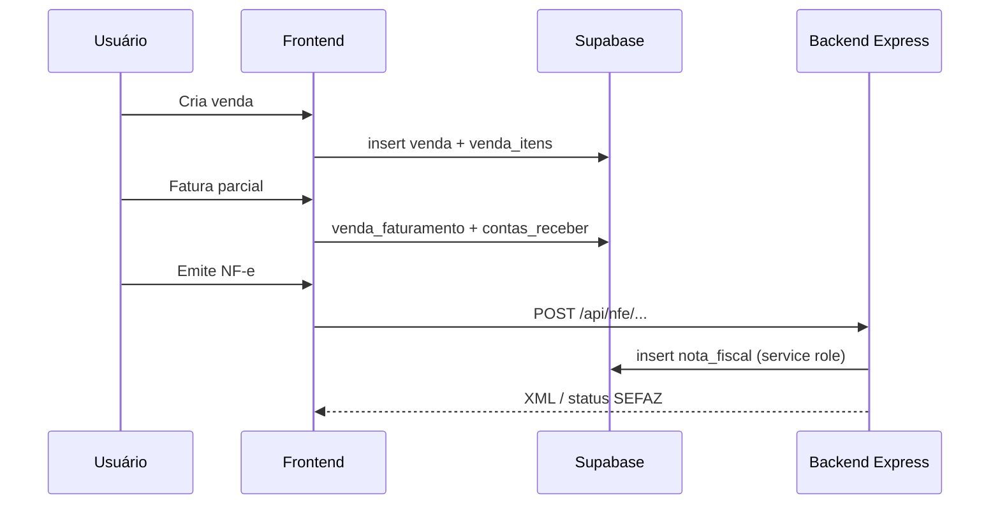

# Design do Sistema — Guia para Reutilização

Documento que descreve **padrões de arquitetura, UI e organização de código** do Azoup ERP (`RNWebSupabase`), pensado para ser replicado em outros projetos React Native / Expo Web com Supabase.

---

## Stack e divisão de responsabilidades

| Camada | Tecnologia | Responsabilidade |
|--------|------------|------------------|
| Frontend | React Native + Expo Web | UI, CRUD via Supabase anon, navegação por estado |
| BaaS | Supabase (PostgreSQL + Auth + Storage) | Dados, RLS, autenticação |
| Backend | Node.js + Express | Stripe, NF-e, IA, webhooks, operações com service role |
| Pagamentos | Stripe | Assinaturas, checkout, portal do cliente |

**Regra de ouro:** CRUD do dia a dia → **Supabase no frontend** (anon key + RLS). Segredos, webhooks e integrações sensíveis → **Express com service role**.

---

## Arquitetura de navegação

### Shell único com menu por chave (state machine)

Em vez de empilhar dezenas de rotas no React Navigation, o app autenticado usa **um shell** (`DashboardScreen`) com:

```javascript
const [activeMenu, setActiveMenu] = useState('Home');
const [navigationParams, setNavigationParams] = useState(null);

// renderMainContent()
switch (activeMenu) {
  case 'Clients': return <ClientsView ... />;
  case 'Products': return <ProductsView ... />;
  case 'ProductionKanban': return <ProducaoKanban ... />;
  // ...
}
```

| Estado | Função |
|--------|--------|
| `activeMenu` | Chave da tela atual (`'Home'`, `'Clients'`, `'Settings'`, …) |
| `navigationParams` | Payload entre telas (deep link, rascunho da IA, retorno) |
| `setActiveMenu` | Repassado aos filhos para atalhos e dashboards |
| `canAccessMenu(menu)` | RBAC — Set de telas permitidas por usuário |

**Por que usar:** ERPs com 50+ módulos ficam previsíveis sem árvore profunda de navigators.

### Três modos por entidade (list → form → dashboard)

Containers como `ClientsView`, `ProductsView`, `SuppliersView`:

```javascript
const [viewMode, setViewMode] = useState('list'); // 'list' | 'form' | 'dashboard'

if (viewMode === 'form') return <ClientForm onCancel={() => setViewMode('list')} />;
if (viewMode === 'dashboard') return <ClienteDashboardScreen ... />;
return <ClientList onEditClient={...} onViewDashboard={...} />;
```

| Modo | Componente típico |
|------|-------------------|
| `list` | `*List.js` — busca, tabela/cards, ações |
| `form` | `*Form.js` — criar/editar |
| `dashboard` | `*DashboardScreen.js` — KPIs e histórico da entidade |

Cadastros auxiliares (categorias, tipos) usam só `list | form`.

---

## Sistema de tema (claro / escuro)

**Arquivos:** `contexts/ThemeContext.js`, `constants/colors.js` (legado)

### Padrão

1. Dois objetos planos: `lightTheme` e `darkTheme` com tokens semânticos:
   - `primary`, `background`, `surface`, `text`, `textMuted`
   - `borderInput`, `cadastroAction`, `sidebarBg`, `error`, `success`
2. `ThemeProvider` expõe `{ theme, isDark, toggleTheme }`.
3. Persistência: `AsyncStorage` + `localStorage` no web (leitura antes do primeiro paint para evitar flash).
4. Web: injetar CSS global para `<select>`, inputs e `data-theme` no `<html>`.

### Consumo em componentes

```javascript
const { theme } = useTheme();
const styles = useMemo(() => getStyles(theme), [theme]);

// getStyles no final do arquivo:
function getStyles(theme) {
  return StyleSheet.create({
    card: { backgroundColor: theme.surface, borderColor: theme.border },
  });
}
```

**Convenção:** CTAs pós-login usam `theme.cadastroAction` (azul no claro, laranja no escuro).

---

## Kit de formulários (design system)

**Pasta:** `frontend/src/components/ui/`

| Componente | Uso |
|------------|-----|
| `FormInput` | TextInput temático, focus ring, `cadastroText` |
| `FormLabel` | Label + asterisco obrigatório |
| `FormField` | Label + input ou children |
| `FormPicker` / `FormPickerShell` | Select nativo estilizado |
| `CadastroFormActionsFooter` | Salvar + menu (Inativar / Excluir) |
| `CadastroListActionsMenu` | Editar + ⋮ na listagem |

**Estilos compartilhados:** `styles/formInputStyles.js`
- Altura padrão 36px (`FORM_CONTROL_HEIGHT`)
- `getStandardPickerStyles(theme)` para `Picker` raw

### Receita de uma tela de cadastro

1. `useTheme()` + `getStyles(theme)`.
2. Campos com `FormInput` / `FormPicker`.
3. Erros com `toFriendlyErrorMessage(err)` (`utils/friendlyErrorMessage.js`).
4. Rodapé `CadastroFormActionsFooter`.
5. Confirmações de exclusão/inativação via `utils/cadastroRecordActions.js`.
6. Auditoria opcional: `logAudit()` (`services/auditService.js`).

---

## Padrão de dashboards

### KPIs reutilizáveis

| Componente | Função |
|------------|--------|
| `HomeStatCard` | Ícone, título, valor, variação (↑/↓) |
| `HomeStatCardsGrid` | Grid responsivo de cards |
| `homeDashboardLayoutStyles.js` | Tokens de layout |

### Tipos de dashboard

**Por módulo** (visão geral do domínio):
- Home, Financeiro, Vendas, Produção, Estoque

**Por entidade** (drill-down de um registro):
- Cliente, Fornecedor, Produto, Tecido, Aviamento

### Composição típica

```
ScrollView
  ├── Filtros (período, empresa) — FilterPopupButton / DateRangeFilterPicker
  ├── HomeStatCardsGrid (KPIs)
  ├── Gráficos (HomeFaturamentoChart, etc.)
  ├── Seções em cards (listas recentes, rankings)
  └── Barras de progresso para rankings (rankBadge + barFill)
```

**Dados:** queries Supabase com `.eq('cliente_id', userData.cliente_id)` ou `cliente_id_tenant`.

---

## Layout responsivo

**Hook central:** `utils/responsiveLayout.js`

| Breakpoint | Variável | Comportamento |
|------------|----------|---------------|
| `< 480px` | `isPhone` | Cards full-width, tipografia compacta |
| `< 768px` | `isMobile` | 2 colunas de KPIs, filtros empilhados |
| `< 1024px` | `isMobileNav` | Menu lateral = drawer overlay (tablet + mobile) |
| `≥ 1024px` | desktop | Sidebar fixa |

**Cards KPI:**
- Desktop: ~4 por linha (`23.5%`)
- Mobile: 2 por linha (`48%`)
- Phone: 1 por linha (`100%`)

Use `useWindowDimensions()` ou `useResponsiveLayout()` — **nunca** magic numbers espalhados sem documentar.

---

## Estrutura de pastas (frontend)

```
frontend/src/
├── screens/           # Rotas de alto nível (Login, Dashboard, Billing, SignUp)
├── components/        # Features (~150 arquivos, majoritariamente flat)
│   └── ui/            # Design system (Form*, Home*, charts)
├── contexts/          # ThemeContext, DashboardTopBarContext
├── hooks/             # useDashboardTopBarTitle, etc.
├── services/          # supabase, billing, ai, audit, objectStorage
├── utils/             # máscaras, datas, PDFs, gates de billing, routers IA
├── constants/         # config estática (trial, popButtonColors)
└── styles/            # formInputStyles, homeDashboardLayoutStyles
```

### Convenção de nomes

| Sufixo | Significado | Exemplo |
|--------|-------------|---------|
| `*List` | Listagem com busca | `ClientList.js` |
| `*Form` | Criar/editar | `ProductForm.js` |
| `*Screen` | Fluxo ou módulo full-page | `ContasReceberScreen.js` |
| `*DashboardScreen` | Analytics | `FinanceiroDashboardScreen.js` |

Domínios agrupados por **prefixo no nome**, não por subpastas: `Producao*`, `Estoque*`, `NotaFiscal*`.

---

## Backend Express

**Entrada:** `backend/index.js`

```
app.use('/api/billing', billingRouter);  // antes do express.json() — webhook Stripe
app.use(express.json());
// rotas IA, NF-e, etc.
```

| Módulo | Arquivo | Exemplos |
|--------|---------|----------|
| Billing | `billingRoutes.js` | checkout, portal, upgrade, webhook, créditos IA |
| IA | `index.js` + assistants | cadastro, financeiro, mover OP |
| Limites | `billingMiddleware.js`, `billingLimits.js` | usuários/empresas |

**Frontend → backend:** `services/billingService.js` + `utils/backendUrl.js`
- `EXPO_PUBLIC_BACKEND_URL`
- Fallback same-origin em dev
- Detecção de IP local para CORS

---

## Assistente de IA (arquitetura em camadas)

### Modal global (cadastro por voz/texto)

```
VoiceProductAssistantModal
  → aiAssistantApi (POST /api/ai/...)
  → cadastroAssistantRouter (tipo → tela)
  → navigationParams + setActiveMenu
  → Form abre pré-preenchido
```

### Assistente contextual (dashboard)

```
DashboardAIAssistantModal
  → contextMenu + screenContextData
  → resumo PDF + chat Q&A
  → créditos IA (AiCreditsPurchaseButton)
```

### WhatsApp

```
Meta webhook → whatsappAssistantBridge → /api/ai/cadastro/chat
Estado: whatsapp_ia_sessions (pending_* jsonb)
Intents: regex/keywords + fluxos confirmar/cancelar
```

**Tenant:** sempre resolver UUID do tenant antes de chamar IA (`utils/tenantClienteId.js`).

---

## Utilitários compartilhados (replicar em novos projetos)

| Utilitário | Arquivo | Função |
|------------|---------|--------|
| Erros amigáveis | `friendlyErrorMessage.js` | Mensagens para o usuário |
| Máscaras BR | `masks.js` | CPF, CNPJ, CEP, capitalize |
| Datas BR | `dateBr.js` | ISO, presets de período |
| Moeda BR | `formatCurrencyBr.js` | `formatCurrencyBRL`, `formatMoneyBr` |
| Billing gate | `billingAccessGate.js` | Trial expirado, plano inativo |
| Ações de cadastro | `cadastroRecordActions.js` | Delete/toggle com validação de uso |
| Backend URL | `backendUrl.js` | fetch com fallback |

---

## Padrões de código

### Supabase no frontend

```javascript
const { data, error } = await supabase
  .from('produtos')
  .select('*, categorias(nome)')
  .eq('cliente_id', userData.cliente_id)
  .order('nome');
```

### Platform branching

```javascript
if (Platform.OS === 'web') window.alert(msg);
else Alert.alert('Erro', msg);
```

### Modais embutidos (“Novo” inline)

Cadastros relacionados abrem modal com sub-form sem sair da tela pai:

```javascript
const [showModalCategoria, setShowModalCategoria] = useState(false);

<TouchableOpacity onPress={() => setShowModalCategoria(true)}>
  <Text>Novo</Text>
</TouchableOpacity>

<Modal visible={showModalCategoria}>
  <CategoriaForm onSuccess={handleAfterSave} onCancel={...} />
</Modal>
```

Após salvar: recarregar lista + selecionar o registro criado.

### Top bar dinâmica

`DashboardTopBarProvider` + `useDashboardTopBarTitle()` — filhos definem título enquanto montados.

### RBAC por tela

`usuarios.permissoes_telas` / `tipos_usuario.telas_acesso` → `allowedMenus` Set → `canAccessMenu('Clients')`.

---

## Checklist para replicar em outro projeto

1. [ ] `ThemeProvider` com tokens light/dark + persistência web
2. [ ] Shell autenticado com `activeMenu` + `switch` de conteúdo
3. [ ] RBAC `canAccessMenu` antes de renderizar módulos
4. [ ] Por entidade: `viewMode` list | form | dashboard
5. [ ] Pasta `components/ui/` com FormInput, FormPicker, footers
6. [ ] `HomeStatCard` + grid responsivo para dashboards
7. [ ] Breakpoints 480 / 768 / 1024 documentados
8. [ ] Supabase anon no app; Express service role para segredos
9. [ ] `*Service.js` fino para HTTP (billing, IA)
10. [ ] `utils/` para locale BR, erros, tenant ID
11. [ ] Migrations SQL versionadas + doc de tenancy (`cliente_id` vs `cliente_id_tenant`)
12. [ ] Auditoria e ações destrutivas com confirmação centralizada

---

## Referências no repositório

| Documento / pasta | Conteúdo |
|-------------------|----------|
| `docs/DATABASE_STRUCTURE.md` | Modelo de dados completo |
| `frontend/docs/KANBAN_PRODUCAO_E_DESIGN.md` | Kanban de produção |
| `MANUAL_SISTEMA_AZOUP_SUPORTE_IA.md` | Manual para IA de suporte |
| `frontend/src/screens/DashboardScreen.js` | Shell principal |
| `frontend/src/contexts/ThemeContext.js` | Tema |
| `frontend/src/components/ui/` | Design system |

---

## Diagrama — fluxo de dados típico (venda)



---

*Este guia descreve decisões intencionais do Azoup ERP para facilitar consistência em forks e novos produtos na mesma stack.*
