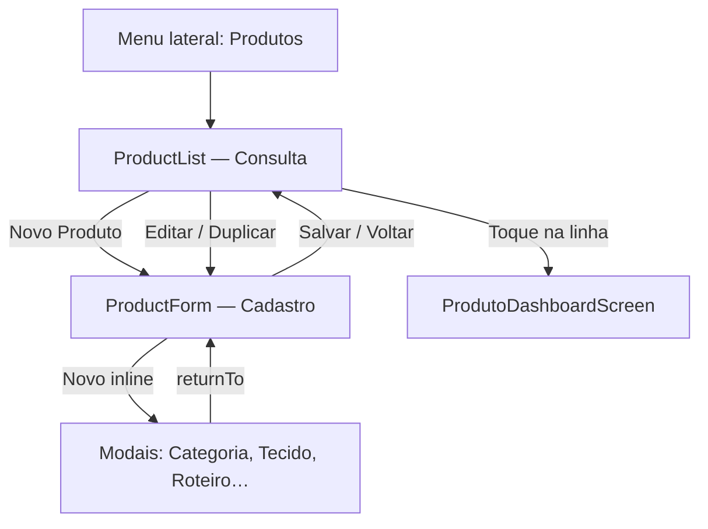
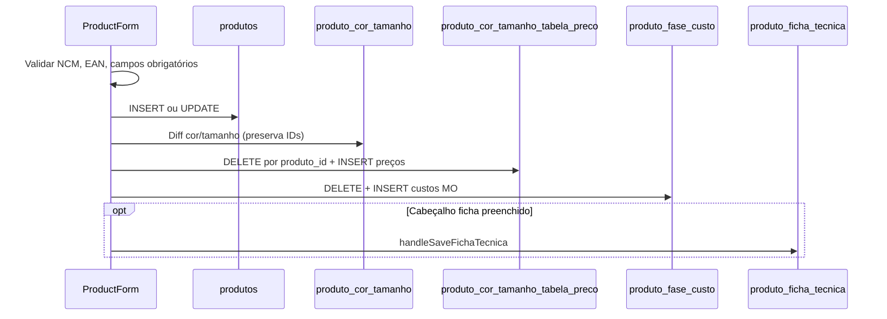

# Tela de Cadastro e Edição de Produtos — Layout e Tabelas

Referência para integração com outros sistemas (e-commerce, ERP externo, BI). Descreve a **estrutura visual** das telas e **quais tabelas** do Supabase cada área lê ou grava.

**Código-fonte:** `frontend/src/components/ProductList.js`, `ProductForm.js`, orquestração em `DashboardScreen.js` (`ProductsView`).

**Documentos relacionados:** `docs/KANBAN_VENDA_PEDIDO_APROVADO_E_PRODUTOS.md` (payload de produtos/variações), `docs/SISTEMA_ESTOQUE_INTEGRACAO_ECOMMERCE.md` (estoque por `produto_cor_tamanho.id`).

---

## 1. Fluxo de navegação



| Modo | Componente | Quando |
|------|------------|--------|
| Lista | `ProductList` | Padrão ao abrir **Produtos** |
| Formulário | `ProductForm` | Novo, editar, duplicar ou retorno de cadastro rápido (voz, estoque, etc.) |
| Dashboard | `ProdutoDashboardScreen` | Clique no produto na lista (estoque por variação, resumo) |

`ProductsView` alterna `viewMode`: `'list'` | `'form'` | dashboard interno.

---

## 2. Tela de consulta — `ProductList`

### Layout

```
┌─────────────────────────────────────────────────────────┐
│  Consulta de Produtos                    [+ Novo Produto]│
├─────────────────────────────────────────────────────────┤
│  🔍 Pesquisar por nome ou SKU...                         │
├─────────────────────────────────────────────────────────┤
│  Desktop: tabela horizontal scroll                       │
│  | Produto | Categoria | SKU | Variações | Ações |       │
│  Mobile: cards com nome, SKU, badge Ativo/Inativo,       │
│          categoria, subcategoria, qtd variações          │
└─────────────────────────────────────────────────────────┘
```

### Colunas / informações exibidas

| Campo na UI | Origem |
|-------------|--------|
| Nome | `produtos.nome` |
| Status Ativo/Inativo | `produtos.inativo` |
| Categoria | `categorias.nome` (join) |
| Subcategoria | `subcategorias.nome` (join) |
| SKU | `produtos.sku` |
| Qtd. variações | `count(produto_cor_tamanho)` |

### Ações

| Ação | Comportamento |
|------|----------------|
| **Novo Produto** | Abre `ProductForm` vazio |
| **Editar** | `ProductForm` com `product` |
| **Duplicar** | `ProductForm` com `isDuplicating=true` (limpa IDs, SKU variação, imagens) |
| **Excluir** | `DELETE produtos` — bloqueado se houver FK (venda, estoque, NF) |
| **Toque na linha** | Abre dashboard do produto |

### Query da lista

```sql
SELECT produtos.*,
       categorias(nome),
       subcategorias(nome),
       produto_cor_tamanho(count)
FROM produtos
WHERE cliente_id = :tenant_id
ORDER BY nome;
```

---

## 3. Shell do formulário — `ProductForm`

### Estrutura geral

```
┌─────────────────────────────────────────────────────────┐
│  ←  Editar Produto / Novo Produto                        │
├─────────────────────────────────────────────────────────┤
│  [Dados Principais] [Imagens] [Ficha Técnica] [Produção] [Custos]  ← GlowTabBar
├─────────────────────────────────────────────────────────┤
│  [ Gerar PDF A4 ]                                        │
├─────────────────────────────────────────────────────────┤
│  Conteúdo da aba ativa (card scrollável)                 │
└─────────────────────────────────────────────────────────┘
│  Modal: Salvar antes de sair? (Sim / Não / Descartar)    │
│  ScreenCoachTutorial (somente cadastro novo)             │
```

### Abas (`PRODUCT_FORM_TABS`)

| ID | Label | Ícone | Disponibilidade |
|----|-------|-------|-----------------|
| `dados` | Dados Principais | document-text | Sempre |
| `imagens` | Imagens | images | Após produto persistido* |
| `ficha` | Ficha Técnica | clipboard | Após produto persistido* |
| `produção` | Produção | construct | Após produto persistido* |
| `custos` | Custos | cash | Após produto persistido* |

\* No **cadastro novo**, abas secundárias ficam **desabilitadas** até preencher campos obrigatórios da aba Dados. Ao trocar de aba, o sistema faz **auto-save** silencioso quando necessário.

### Modo `quickCreateOnly`

Usado em fluxos embutidos (ex.: criar produto a partir de outra tela): exibe **somente** a aba Dados Principais, sem `GlowTabBar`.

### Responsividade

- Breakpoint mobile: `width < 768` — linhas viram coluna, chips e matriz de variações compactos.
- Scroll: `NestableScrollContainer` (suporta listas aninhadas na ficha técnica).

---

## 4. Aba 1 — Dados Principais

Arquivo: `renderDadosPrincipais()` em `ProductForm.js`.

### Layout por seções (de cima para baixo)

```
┌─ Card ───────────────────────────────────────────────────┐
│  Dados Gerais                          [ ] Produto Inativo│
│  ┌─────────────────────┬──────────────┐                  │
│  │ Nome do Produto *   │ SKU *        │                  │
│  └─────────────────────┴──────────────┘                  │
│  ┌─────────────────────┬──────────────┐                  │
│  │ NCM * (validado)    │ Unidade *    │                  │
│  └─────────────────────┴──────────────┘                  │
│  ┌─────────────────────┬──────────────┐                  │
│  │ Categoria [Novo]    │ Subcategoria │                  │
│  └─────────────────────┴──────────────┘                  │
│  ┌─────────────────────┬──────────────┐                  │
│  │ Grupo Fiscal * [Novo]│ Origem *    │                  │
│  └─────────────────────┴──────────────┘                  │
├──────────────────────────────────────────────────────────┤
│  Definição de Variações *                                │
│  Adicionar Cor * (Enter)    │  Adicionar Tamanho * (Enter)│
│  [chips cores]              │  [chips tamanhos + setas]   │
├──────────────────────────────────────────────────────────┤
│  Tabela de Preço para Edição [Novo]                      │
│  Variações Geradas (N)                                   │
│  Aplicar para: [P][M][G]…  Preço [____] [Aplicar]        │
│  ┌ mini card ─┐ ┌ mini card ─┐                           │
│  │ Cor - Tam  │ │ Cor - Tam  │  … grid cor × tamanho     │
│  │ Preço      │ │ Preço      │                           │
│  │ SKU Var    │ │ SKU Var    │  (somente leitura)        │
│  │ EAN13      │ │ EAN13      │                           │
│  └────────────┘ └────────────┘                           │
├──────────────────────────────────────────────────────────┤
│  [Criar Produto] / [Salvar Produto]  | Inativar | Excluir│
└──────────────────────────────────────────────────────────┘
```

### Campos — mapeamento UI → banco

| Campo UI | Obrigatório | Tabela.coluna | Observação |
|----------|-------------|---------------|------------|
| Nome | Sim | `produtos.nome` | Capitalizado ao salvar |
| SKU | Sim | `produtos.sku` | Somente dígitos; único por `cliente_id` |
| Produto inativo | Não | `produtos.inativo` | Checkbox |
| NCM | Sim (≥8 dígitos) | `produtos.ncm` | Validado via `ncmService`; só dígitos no banco |
| CEST | — | `produtos.cest` | **Não aparece na tela**; preenchido automaticamente do NCM |
| Unidade | Sim | `produtos.unidade` | Ex.: UN, KG, PC |
| Categoria | Não | `produtos.categoria_id` | FK `categorias` |
| Subcategoria | Não | `produtos.subcategoria_id` | FK `subcategorias`; filtrada pela categoria |
| Grupo fiscal | Sim | `produtos.grupo_fiscal_id` | FK `grupos_fiscais` |
| Origem | Sim | `produtos.origem_id` | FK `origens_produtos` (código 0–8) |
| Cor (lista) | Sim (≥1) | `produto_cor_tamanho.cor` | Chips; Enter adiciona |
| Tamanho (lista) | Sim (≥1) | `produto_cor_tamanho.tamanho` | Reordenável; aceita `P,M,G` na mesma linha |
| Ordem do tamanho | — | `produto_cor_tamanho.ordem` | Índice na grade |
| Preço (por card) | Não* | `produto_cor_tamanho_tabela_preco.preco` | Por tabela selecionada |
| SKU Var | — | `produto_cor_tamanho.sku_variacao` | Gerado: SKU pai + sufixo; somente leitura na UI |
| EAN13 | Não | `produto_cor_tamanho.ean13` | 13 dígitos; único entre variações |

\* Preço zero é gravado se a tabela for "Padrão" (`padrao`/`padrão` no nome).

### Matriz de variações

- Chave interna no front: `` `${cor}-${tamanho}` ``
- Combinações = produto cartesiano `cores × tamanhos`
- **Bulk apply:** seleciona tamanhos + valor → preenche preço em massa nos mini cards
- Ao editar, variações existentes são **atualizadas por (cor, tamanho)** para preservar `produto_cor_tamanho.id` (FK em `venda_itens`)

### Rodapé de ações (`CadastroFormActionsFooter`)

| Botão | Edição | Cadastro novo |
|-------|--------|---------------|
| Salvar / Criar | Salvar Produto | Criar Produto |
| Inativar/Ativar | Sim | Não |
| Excluir | Sim (se sem vínculos) | Não |

---

## 5. Aba 2 — Imagens

```
┌─ Card ───────────────────────────────────────────────────┐
│  Imagens do Produto                    [+ Adicionar Foto] │
│  Grid de mini cards: Foto 1, Foto 2…                     │
│  • thumbnail + lixeira                                   │
│  • toque = modal preview fullscreen                      │
└──────────────────────────────────────────────────────────┘
```

| Campo | Tabela.coluna | Storage |
|-------|---------------|---------|
| URL da imagem | `produto_imagem.url_imagem` | Upload R2 via `objectStorage` |
| Observação | `produto_imagem.observacao` | Opcional |

- Upload **imediato** ao selecionar (não espera salvar produto).
- Exige `productId` (produto já salvo na aba Dados).

---

## 6. Aba 3 — Ficha Técnica

```
┌─ Card (ScrollView aninhado) ──────────────────────────────┐
│  Ficha Técnica do Produto                                 │
│  Observação da Ficha (textarea)                           │
│  [ ] Produto dividido em partes → lista de partes         │
│  Nível de Dificuldade (1–5 bolinhas)                      │
│  ─────────────────────────────────────────────────────    │
│  Consumo de Tecidos [expandir/recolher]                   │
│    • card adicionar: tecido, unidade, tipo consumo        │
│    • lista de tecidos vinculados + matriz tamanho/cor     │
│  ─────────────────────────────────────────────────────    │
│  Consumo de Aviamentos [expandir/recolher]                │
│    • card adicionar: aviamento, tipo, consumo             │
│    • lista + matriz tamanho/cor do produto × var. aviamento│
│  [ Salvar Ficha Técnica ]                                 │
└──────────────────────────────────────────────────────────┘
```

### Tipos de consumo (tecidos)

| `tipo_consumo` | UI | Tabela filha |
|----------------|-----|--------------|
| `geral` | Um valor para todas as variações | `ficha_tecnica_consumo_tecido.consumo_geral` |
| `tamanho` | Por tamanho do produto | `ficha_tecnica_consumo_tecido_tamanho` |
| `tamanho_cor` | Por cor + tamanho (+ cor do tecido) | `ficha_tecnica_consumo_tecido_tamanho.cor` |

### Tipos de consumo (aviamentos)

| `tipo_consumo` | UI |
|----------------|-----|
| `geral` | Consumo único |
| `tamanho` | Por tamanho do produto |
| `tamanho_cor` | Matriz produto (cor/tam) × aviamento (cor/tam) |

### Botão "Salvar Ficha Técnica"

Persiste cabeçalho + partes + consumos. Auto-save do cabeçalho também ocorre ao trocar de aba ou sair com confirmação.

---

## 7. Aba 4 — Produção

```
┌─ Card ───────────────────────────────────────────────────┐
│  Roteiro de Produção          Total Mão de Obra: R$ …    │
│  Selecione o Roteiro [Novo]                              │
│  ┌── Kanban horizontal (fases) ──────────────────────┐   │
│  │ [1] Fase A  │ [2] Fase B  │ [3] Corte …           │   │
│  │ tempo       │ tempo       │ badge Corte           │   │
│  │ Custo M.O.  │ Custo M.O.  │ Custo M.O.            │   │
│  └───────────────────────────────────────────────────┘   │
└──────────────────────────────────────────────────────────┘
```

| Campo UI | Tabela.coluna |
|----------|---------------|
| Roteiro selecionado | `produtos.roteiro_id` → `roteiros_producao` |
| Custo mão de obra por fase | `produto_fase_custo.custo_mao_obra` |
| Fase | `produto_fase_custo.fase_id` → `roteiro_producao_fases` |

Fases carregadas de `roteiro_producao_fases` ordenadas; exibe `tempo_medio`, `unidade_tempo`, flag `is_corte`.

---

## 8. Aba 5 — Custos

Aba **somente leitura/cálculo** (não grava tabela própria de custo unitário).

```
┌─ Card ───────────────────────────────────────────────────┐
│  Análise de Custos    [filtro tamanhos]  Média: R$ …     │
│  Cálculo Sugerido para Tabela                            │
│    Lucro %  |  Valor médio sugerido                      │
│    Tabela de preço [Novo]                                │
│    [ Atualizar Preço na Tabela ]                         │
│  Cards agrupados por custo igual (tecido+aviamento+MO)   │
│    • ex.: Azul — 38 40 42                                │
│    • breakdown: tecido, aviamento, mão de obra, total     │
└──────────────────────────────────────────────────────────┘
```

### Fórmula por variação (cor × tamanho)

```
custo = Σ(consumo_tecido × custo_tecido)
      + Σ(consumo_aviamento × custo_aviamento)
      + Σ(custo_mao_obra das fases do roteiro)

preço_sugerido = custo_variacao × (1 + lucro% / 100)
```

**"Atualizar Preço na Tabela"** faz `upsert` em `produto_cor_tamanho_tabela_preco` e reflete na aba Dados.

---

## 9. Tabelas do banco — visão completa

### 9.1 Gravadas diretamente pelo `ProductForm`

| Tabela | Papel | Operação típica |
|--------|-------|-----------------|
| **`produtos`** | Cabeçalho do produto | INSERT / UPDATE |
| **`produto_cor_tamanho`** | Variação cor/tamanho (SKU var, EAN) | INSERT / UPDATE / DELETE (diff) |
| **`produto_cor_tamanho_tabela_preco`** | Preço por variação × tabela | DELETE all + INSERT (save) ou UPSERT (aba Custos) |
| **`produto_fase_custo`** | Custo MO por fase | DELETE + INSERT |
| **`produto_imagem`** | Fotos | INSERT / DELETE (upload imediato) |
| **`produto_ficha_tecnica`** | Cabeçalho ficha (1:1 produto) | INSERT / UPDATE |
| **`produto_ficha_tecnica_partes`** | Partes do produto (terno, etc.) | DELETE + INSERT |
| **`ficha_tecnica_consumo_tecido`** | Tecido na ficha | INSERT / UPDATE / DELETE |
| **`ficha_tecnica_consumo_tecido_tamanho`** | Consumo por tam/cor | INSERT / UPDATE / DELETE |
| **`ficha_tecnica_consumo_aviamento`** | Aviamento na ficha | INSERT / UPDATE / DELETE |
| **`ficha_tecnica_consumo_aviamento_tamanho`** | Consumo aviamento por variação | INSERT / UPDATE / DELETE |

### 9.2 Schema — `produtos`

| Coluna | Tipo | UI |
|--------|------|-----|
| `id` | UUID PK | — |
| `cliente_id` | UUID FK | Tenant (`clientes_azoup`) |
| `nome` | VARCHAR | Dados Principais |
| `sku` | VARCHAR | Dados Principais |
| `categoria_id` | UUID FK | Dados Principais |
| `subcategoria_id` | UUID FK | Dados Principais |
| `inativo` | BOOLEAN | Checkbox |
| `unidade` | VARCHAR | Dados Principais |
| `ncm` | VARCHAR | Dados Principais |
| `cest` | VARCHAR | Automático (NCM) |
| `origem_id` | UUID FK | Dados Principais |
| `grupo_fiscal_id` | UUID FK | Dados Principais |
| `roteiro_id` | UUID FK | Aba Produção |
| `created_at`, `updated_at` | TIMESTAMPTZ | — |

**Constraint:** `UNIQUE (cliente_id, sku)` quando SKU informado.

### 9.3 Schema — `produto_cor_tamanho`

| Coluna | Tipo | UI / integração |
|--------|------|-----------------|
| `id` | UUID PK | **ID preferido para e-commerce e estoque** (`variacao_id`) |
| `produto_id` | UUID FK | Produto pai |
| `cor` | VARCHAR | Chip de cor |
| `tamanho` | VARCHAR | Chip de tamanho |
| `ordem` | INTEGER | Ordem na grade |
| `sku_variacao` | VARCHAR | Mini card (readonly) |
| `ean13` | VARCHAR(13) | Mini card |
| `estoque` | INTEGER | **Legado** — estoque real está em `estoque_movimentacao` |
| `preco_venda` | DECIMAL | **Legado** — preço em `produto_cor_tamanho_tabela_preco` |

**Constraint:** `UNIQUE (produto_id, cor, tamanho)`.

### 9.4 Schema — `produto_cor_tamanho_tabela_preco`

| Coluna | Tipo | Descrição |
|--------|------|-----------|
| `produto_id` | UUID | Produto |
| `cor` | VARCHAR | Cor normalizada |
| `tamanho` | VARCHAR | Tamanho normalizado |
| `tabela_preco_id` | UUID FK | `tabela_precos` |
| `preco` | DECIMAL | Valor de venda |

**Constraint:** `UNIQUE (produto_id, cor, tamanho, tabela_preco_id)`.

### 9.5 Schema — demais tabelas de produto

**`produto_imagem`**

| Coluna | Descrição |
|--------|-----------|
| `produto_id` | FK produto |
| `url_imagem` | URL pública (R2) |
| `observacao` | Texto opcional |

**`produto_ficha_tecnica`**

| Coluna | Descrição |
|--------|-----------|
| `produto_id` | UNIQUE — 1 ficha por produto |
| `observacao_ficha_tecnica` | Textarea |
| `dificuldade` | 1–5 |
| `dividido_em_partes` | BOOLEAN |

**`produto_ficha_tecnica_partes`**

| Coluna | Descrição |
|--------|-----------|
| `ficha_tecnica_id` | FK ficha |
| `descricao` | Ex.: Paletó, Calça |
| `ordem` | Sequência |

**`produto_fase_custo`**

| Coluna | Descrição |
|--------|-----------|
| `produto_id` | FK produto |
| `fase_id` | FK `roteiro_producao_fases` |
| `custo_mao_obra` | DECIMAL |
| `cliente_id` | Tenant |

**Constraint:** `UNIQUE (produto_id, fase_id)`.

---

## 10. Tabelas de lookup (leitura + cadastro inline)

Usadas nos pickers; podem ser criadas via modal **Novo** sem sair do formulário.

| Tabela | Uso na tela | Modal / navegação |
|--------|-------------|-------------------|
| `categorias` | Categoria | `CategoriaForm` |
| `subcategorias` | Subcategoria | `SubcategoriaForm` |
| `grupos_fiscais` | Grupo fiscal | Menu `GrupoFiscalForm` |
| `origens_produtos` | Origem NF-e | Lista fixa (global) |
| `tabela_precos` | Tabelas de preço | `TabelaPrecoForm` |
| `roteiros_producao` | Roteiro | `RoteiroProducaoForm` |
| `roteiro_producao_fases` | Fases do kanban | Carregado ao escolher roteiro |
| `tecidos` | Ficha técnica | `TecidoForm` |
| `tecido_cor` | Cores do tecido | Automático ao selecionar tecido |
| `aviamentos` | Ficha técnica | `AviamentoForm` |
| `aviamento_cor_tamanho` | Variações do aviamento | Automático |

Todas filtradas por `cliente_id` / tenant, exceto `origens_produtos`.

---

## 11. Fluxo de persistência (`handleSave`)

Ordem ao salvar **Dados Principais**:



### Validações obrigatórias (save)

- Nome, SKU, Unidade, NCM (≥8 dígitos, tabela oficial)
- Grupo fiscal, Origem
- Pelo menos 1 cor e 1 tamanho
- EAN: 13 dígitos se informado; sem duplicata entre variações

### Troca de abas (`switchTab`)

- Auto-save silencioso ao sair de **Dados**, **Imagens** ou **Produção** se houve alteração
- Auto-save do cabeçalho da **Ficha** ao sair dessa aba
- Cadastro novo: primeira ida a aba secundária dispara save dos Dados

---

## 12. Duplicação de produto

`isDuplicating=true`:

| Copia | Não copia |
|-------|-----------|
| Dados gerais, cores, tamanhos, ficha, consumos, roteiro, custos MO | `produtos.id`, `produto_cor_tamanho.id` |
| Estrutura de preços (memória) | SKU variação, EAN13, imagens |
| | Estoque |

Gera **novo** registro em `produtos` no primeiro save.

---

## 13. Integração externa — pontos de atenção

### Identificadores recomendados

| Sistema externo | Campo Azoup |
|-----------------|-------------|
| Produto pai | `produtos.id` ou `produtos.sku` |
| SKU variação | `produto_cor_tamanho.sku_variacao` |
| Variante (estoque/preço) | **`produto_cor_tamanho.id`** |
| EAN/GTIN | `produto_cor_tamanho.ean13` |
| Preço de venda | `produto_cor_tamanho_tabela_preco` + `tabela_precos.id` |

### Export mínimo (catálogo + preço tabela Padrão)

```sql
SELECT
  p.id AS produto_id,
  p.sku,
  p.nome,
  p.ncm,
  p.cest,
  p.unidade,
  p.inativo,
  pct.id AS variacao_id,
  pct.cor,
  pct.tamanho,
  pct.sku_variacao,
  pct.ean13,
  pcttp.preco
FROM produtos p
JOIN produto_cor_tamanho pct ON pct.produto_id = p.id
LEFT JOIN produto_cor_tamanho_tabela_preco pcttp
  ON pcttp.produto_id = p.id
 AND pcttp.cor = pct.cor
 AND pcttp.tamanho = pct.tamanho
 AND pcttp.tabela_preco_id = :tabela_padrao_id
WHERE p.cliente_id = :tenant_id;
```

### O que a tela **não** grava

- **Estoque** — módulo Estoque (`estoque_movimentacao`); ver doc de estoque
- **Regras fiscais detalhadas** — apenas vínculo `grupo_fiscal_id`; regras em `grupo_fiscal_regra` etc.

---

## 14. Arquivos e migrations

| Assunto | Caminho |
|---------|---------|
| Formulário | `frontend/src/components/ProductForm.js` |
| Lista | `frontend/src/components/ProductList.js` |
| Orquestração | `frontend/src/screens/DashboardScreen.js` → `ProductsView` |
| Schema base | `frontend/database/products_schema.sql` |
| Preços multi-tabela | `frontend/database/update_multi_price_tables.sql` |
| Imagens + ficha | `frontend/database/produto_imagens_ficha_schema.sql` |
| Consumo tecido/aviamento | `frontend/database/produto_tecidos_schema.sql`, `produto_aviamentos_schema.sql` |
| Partes da ficha | `frontend/database/migration_produto_ficha_tecnica_partes.sql` |
| Custo MO | `frontend/database/produto_fase_custo_schema.sql` |
| Roteiro no produto | `frontend/database/add_roteiro_to_products.sql` |
| Ordem tamanhos | `frontend/database/produto_cor_tamanho_ordem_migration.sql` |
| SKU/EAN variação | `frontend/database/update_sku_schema.sql` |
| Schema consolidado | `frontend/database/SUPABASE_FULL_SCHEMA.sql` |

---

## 15. Glossário

| Termo | Significado |
|-------|-------------|
| **Variação** | Combinação cor + tamanho (`produto_cor_tamanho`) |
| **Matriz** | Grid cor × tamanho com preço/SKU/EAN |
| **Tabela de preço** | Lista de preços do tenant (`tabela_precos`); padrão "Padrão" |
| **Ficha técnica** | BOM do produto: tecidos + aviamentos + dificuldade |
| **Roteiro** | Sequência de fases de produção vinculada ao produto |
| **Quick create** | Cadastro só com Dados Principais, a partir de outra tela |
